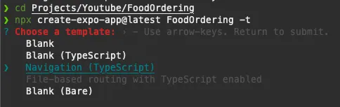
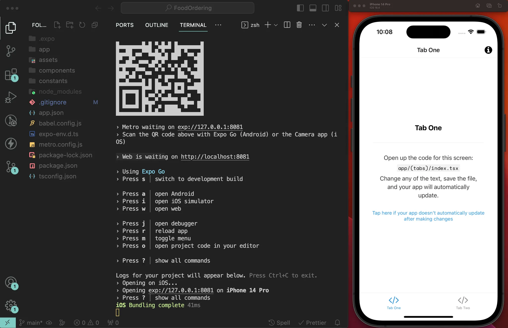

# React Native Expo Setup App
Para este proyecto seguiremos algunas de las tendencias dentro de la industria tecnológica, es por ello que usaremos **React Native y Expo** para nuestro Frontend y **Supabase** para nuestro Backend.

## Requisitos

📖 https://docs.expo.dev/get-started/installation/

Para usar Expo, necesitamos instalar las siguientes herramientas:

- [Node.js LTS release](https://nodejs.org/en/) - Only Node.js LTS releases (even-numbered) are recommended.
    
    Citando a Node.js, "Las aplicaciones en producción sólo deberían utilizar [las versiones Active LTS o Maintenance LTS](https://nodejs.org/en/about/releases/) ". Puedes instalar Node.js utilizando una herramienta de gestión de versiones (como `nvm` o `volta` o cualquier otra de tu elección) para cambiar entre diferentes versiones de Node.js.
    
- [Git](https://git-scm.com/) para control de versiones.

- [Watchman](https://facebook.github.io/watchman/docs/install#buildinstall) (para usuarios de Linux o macOS users).

### Expo go

📖 https://docs.expo.dev/get-started/expo-go/

La forma más fácil de ejecutar y debuggear una Expo App es usar la app [**Expo Go**](https://expo.dev/client) disponible para iOS y Android.

### Editor de Código (IDE)

Podemos usar cualquier editor de código o IDE a nuestra elección.

Mi elección: [**VSCode**](https://code.visualstudio.com/)

### (Optional) Android Studio & Xcode

En algunos casos, es posible que tengamos que crear el proyecto nativo de Android e iOS y/o utilizar un emulador de Android o un simulador de iOS. En ese caso, tendrás que configurar Android Studio y Xcode.

Sigue los pasos de la documentación de React Native: https://reactnative.dev/docs/environment-setup

Si tenemos un sistema Windows o Linux podremos compilar y publicar nuestras apps para iOS utilizando compilaciones en la nube con Expo EAS.

## Crear un proyecto Expo desde 0

Es tan simple como ejecutar este comando:

```
npx create-expo-app@latest <nombreApp> -t
```

Si no tenemos instalado el paquete `create-expo-app`, npx lo hará por nosotros. Solo hay que presionar `Y` si nos lo pregunta. 

Como platilla elegiremos “**Navigation (TypeScript)”.**



Inicializamos una nueva Expo App usando:
```
npx create-expo-app
```

Una vez nuestro proyecto está inicializado, procederemos a abrirlo en nuestro editor de código.

Abriremos una terminal y levantaremos un servidor de desarrollo con el comando:
```
npm start
```

El siguiente paso es ejecutar nuestra app en un dispositivo. La forma más sencilla es descargar la app Expo Go y, a continuación, escanear el QR que aparecerá en el terminal. De esta forma, podremos seguir desarrollando la app y ver las actualizaciones en tiempo real directamente en tu dispositivo.
Opcionalmente, puedes ejecutar la app en un Simulador iOS pulsando `i` o en un Emulador Android pulsando `a`. Pero para esto, tienes que configurar los emuladores usando Xcode o Android Studio.



Para comprobar que funcione correctamente puedes ir a
`app/(tabs)/index.tsx` y cambiar el texto a "Hello World!". Si los cambios se aplican al momento podemos continuar.

### Declarar la estructura de carpetas

No es extrictamente necesario, pero sí es muy recomendable almacenar todo el codigo fuente de la App en una carpeta separada llamada `src`. Para ello, crearemos la carpeta `src` en la carpeta root de nuestro proyecto y moveremos dentro las siguientes carpetas:

- app → src/app
- components → src/components
- constants → src/constants

Abre el archivo `src/app/_layout.tsx` y actualiza la ruta relativa del import para reflejar los cambios correctamente:

```
require('../../assets/fonts/SpaceMono-Regular.ttf')
```

### Reiniciar el servidor de desarrollo

Abre el terminal en el que esta ejecutándose nuestro servidor de desarrollo (dónde ejecutamos `npm start`), presiona "Ctrl + C" para parar el servidor, luego ejecuta de nuevo `npm start`.

### Commitea los cambios

Este es un buen punto para guardar nuestros cambios y establecer un punto de control al que volver si algo sale mal.

1. Comprueba el estado de los archivos modificados:

```
git status
```

2. Añade todos los cambios al staging area

```
git add .
```

3. Commitea todos los cambios del the staging area

```
git commit -m "init expo project"
```

Subir los cambios a GitHub también sería un punto recomendable.

## Bibliografía
- [Vídeo guía (notJust.dev)](https://www.youtube.com/watch?v=rIYzLhkG9TA&t=2481s)
- [Guía paso a paso (notJust.dev)](https://notjust.notion.site/React-Native-Supabase-Masterclass-47a69a60bc464c399b5a0df4d3c4a630)
- [Vídeo guía - Parte 1 (midudev)](https://www.youtube.com/watch?v=U23lNFm_J70)
- [Vídeo guía - Parte 2 (midudev)](https://www.youtube.com/watch?v=ZDoiMLqWz2Es)