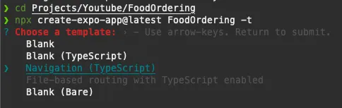
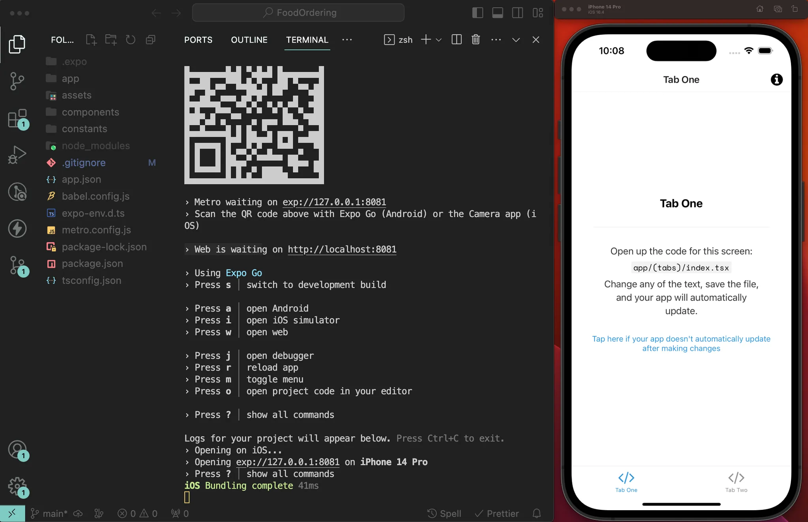

# React Native & Expo App
## Implementation
### 1. Requirements

📖 https://docs.expo.dev/get-started/installation/

To use Expo, we need to install the following tools:

- [Node.js LTS release](https://nodejs.org/en/) - Only Node.js LTS releases (even-numbered) are recommended.
    
    Quoting Node.js, "Production applications should only use [Active LTS or Maintenance LTS releases](https://nodejs.org/en/about/releases/)." You can install Node.js using a version management tool (such as `nvm` or `volta` or any other of your choice) to switch between different versions of Node.js.
    
- [Git](https://git-scm.com/) for version control.

- [Watchman](https://facebook.github.io/watchman/docs/install#buildinstall) (for Linux or macOS users).

#### Expo Go or Development Kit

📖 https://docs.expo.dev/get-started/expo-go/

The easiest way to run and debug an Expo app is by using the [**Expo Go**](https://expo.dev/client) app, available for iOS and Android.

We can also use a Development Kit that includes the Expo development tools, this option is especially useful if we need text fonts other than the default font.

#### Code Editor (IDE)

We can use any code editor or IDE of our choice.

My choice: [**VSCode**](https://code.visualstudio.com/)

#### (Optional) Android Studio & Xcode

In some cases, we may have to create the native Android and iOS projects and/or use an Android emulator or iOS simulator. In that case, you will need to set up Android Studio and Xcode.

Follow the steps from the React Native documentation: https://reactnative.dev/docs/environment-setup

If we are on a Windows or Linux system, we will be able to compile and publish our apps for iOS using cloud builds with Expo EAS.

### 2. Create an Expo Project From Scratch

It's as simple as running this command:

```
npx create-expo-app@latest <nombreApp> -t
```

If we don't have the `create-expo-app` package installed, npx will do it for us. Just press `Y` if it asks.

As the template, we will choose “**Navigation (TypeScript)**.”



Once our project is initialized, we'll proceed to open it in our code editor.

Open a terminal and start a development server with the command:
```
npm start
```

The next step is to run our app on a device. The easiest way is to download the Expo Go app and then scan the QR code that will appear in the terminal. This way, we can continue developing the app and see updates in real-time directly on our device.
Optionally, you can run the app on an iOS Simulator by pressing `i` or on an Android Emulator by pressing `a`. But for this, you need to configure the emulators using Xcode or Android Studio.



To check that everything works correctly, go to `app/(tabs)/index.tsx` and change the text to "Hello World!". If the changes apply instantly, we can continue.

#### Define Folder Structure

It’s not strictly necessary, but it’s highly recommended to store all the app's source code in a separate folder called `src`. To do this, create the `src` folder in the root folder of our project and move the following folders inside:

- app → src/app
- components → src/components
- constants → src/constants

Open the file `src/app/_layout.tsx` and update the relative path of the import to reflect the changes correctly:

```
require('../../assets/fonts/SpaceMono-Regular.ttf')
```

#### Restart the Development Server

Open the terminal where our development server is running (where we ran `npm start`), press "Ctrl + C" to stop the server, then run `npm start` again.

#### Commit Changes

This is a good point to save our changes and establish a checkpoint to return to if something goes wrong.

1. Check the status of the modified files:

```
git status
```

2. Add all changes to the staging area

```
git add .
```

3. Commit all changes in the staging area

```
git commit -m "init expo project"
```

Pushing the changes to GitHub would also be a recommended step.

### 3. References
- [Video Guide (notJust.dev)](https://www.youtube.com/watch?v=rIYzLhkG9TA&t=2481s) - April 2, 2025
- [Step-by-Step Guide (notJust.dev)](https://notjust.notion.site/React-Native-Supabase-Masterclass-47a69a60bc464c399b5a0df4d3c4a630) - April 2, 2025
- [Video Guide - Part 1 (midudev)](https://www.youtube.com/watch?v=U23lNFm_J70) - April 10, 2025
- [Video Guide - Part 2 (midudev)](https://www.youtube.com/watch?v=ZDoiMLqWz2Es) - April 12, 2025