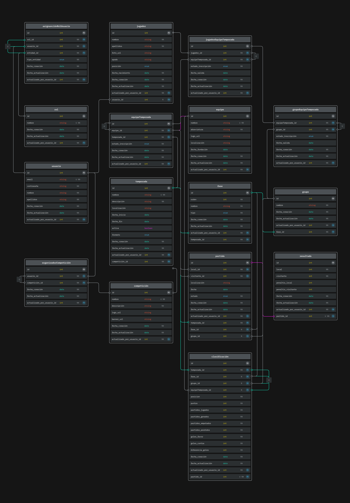

# React Native & Expo App

## Desarrollo

### 1. Instalación de requisitos

Los primeros pasos para empezar a desarrollar una App con React Native y Expo pasan por instalar Node.js junto con los paquetes requeridos para el proyecto. Además, creamos una cuenta en Supabase y una en Expo; aunque esta última es opcional, es muy recomendable, ya que con ella tendremos acceso a servicios como Expo Application Services (EAS).

Para poder probar nuestra App en las fases tempranas de desarrollo usamos un dispositivo físico iOS (iPhone 12 Pro) y un emulador Android (Pixel 8) con Expo Go. Posteriormente, pasamos a un emulador iOS (iPhone SE) y un emulador Android (Pixel 8) con un Kit de Desarrollo, ya que algunas funcionalidades, como usar otras fuentes de texto, no están soportadas en Expo Go.

Puede surgir la pregunta de por qué dejamos de usar un dispositivo físico iOS y pasamos a un simulador. La respuesta se basa en que Apple nos requerirá firmar nuestro Kit de Desarrollo para poder ejecutarlo en un dispositivo físico, y para ello es necesario una cuenta de desarrollador y estar adherido al programa para desarrolladores de Apple, con un coste de 100 €/año.

### 2. Diseño UI / UX

Nuestro principal foco en este proyecto es tener una interfaz atractiva y simple para el usuario. Para ello, hemos tomado ejemplo de aplicaciones profesionales y bien posicionadas en el mercado del fútbol profesional como son [LiveScore](https://www.livescore.com/es) y [SofaScore](https://www.sofascore.com/es-la/).

Para nuestros bocetos usamos la herramienta de diseño Figma, que nos permite agilizar y profesionalizar la maquetación de las distintas pantallas de nuestra App.

Para nuestros diagramas de navegación usamos la herramienta Miro, que nos permite crear todo tipo de diagramas de una manera intuitiva y rápida.

#### 2.1. Diagrama de Navegación

Dado el limitado tiempo del que disponemos, nuestro diagrama de navegación consta de distintas fases de desarrollo. Dichas fases son las siguientes:

-   Fase 1: tonos amarillos
-   Fase 2: tonos naranjas
-   Fase 3: tonos verdes
-   Fase 4: tonos morados
-   Fase 5: tonos grises

Las flechas azules indican un flujo de avance o de mismo nivel, mientras que las rojas indican un flujo de retroceso.

#### 2.2. Mockups / Bocetos de la interfaz

Dado el limitado tiempo del que disponemos, solo se han realizado los bocetos de las pantallas principales hasta la fase 2. Nuestra interfaz se divide en las siguientes pantallas principales:

**Inicio de Sesión:** pantalla de inicio de sesión.

**Inicio / Competiciones:** primera pantalla de la App después del inicio de sesión.

**Detalle Competición:** detalle de una competición en la pestaña de Clasificación para una Liga.

**Detalle Competición 2:** detalle de una competición en la pestaña de Grupos para una Copa.

**Detalle Competición 3:** detalle de una competición en la pestaña de Eliminatoria para una Copa.

**Detalle Competición 4:** detalle de una competición en la pestaña de Partidos para una Copa o Liga.

**Detalle Partido:** detalle de un partido en la pestaña de Estadísticas.

**Detalle Partido 2:** detalle de un partido en la pestaña de Alineaciones.

#### 2.3. Validación del diseño

Para comprobar la usabilidad y corregir errores, compartimos estos bocetos con diferentes personas con distintos grados y ámbitos de conocimiento. Algunas de estas personas y sus aportaciones son:

-   **Diego García**, amplio conocimiento dentro del ámbito futbolístico y colaborador de [@staff19torneos](https://instagram.com/staff19torneos/).
    -   Corrección de siglas y datos a mostrar en las tablas de clasificación.

        
        

-   **Anastasia Datsko**, desarrolladora multiplataforma, cuenta con unas bases sólidas en diseño UI/UX.
    -   Rediseño de la tarjeta de partido.

        

-   **Elena Guzmán**, desarrolladora multiplataforma, cuenta con unas buenas bases en paletas de colores.
    -   Cambios de color en los botones.

        

-   **Adrián López**, CEO de [@staff19torneos](https://instagram.com/staff19torneos/), cliente final, cuenta con un amplio conocimiento en el mundo de los eventos deportivos.
    -   Rediseño de las tarjetas de eliminatoria.

        

    -   Redimensión del resultado y escudos de los equipos en la pantalla de detalle partido.

        

    -   Cambios de color de la tarjeta de alineaciones.

        

# Diseño de Base de Datos para Gestión de Competiciones de Fútbol

## 3. Diseño de Base de Datos

El objetivo principal fue diseñar una estructura de base de datos relacional, escalable y mantenible para la gestión integral de competiciones de fútbol. Permitiéndonos manejar múltiples competiciones (liga, copa, etc.) con distintas temporadas, equipos participantes, jugadores en plantillas (con restricciones de participación), usuarios con roles diferenciados (Organizador, Árbitro, Entrenador/Capitán) y la gestión detallada de partidos y resultados.

Para ello, identificamos las siguientes entidades principales: **Usuario**, **Rol** (define los tipos de roles posibles), **Competición**, **Temporada**, **Equipo**, **Jugador**, **Partido**, **Resultado**, **Fase**, **Grupo**, **EquipoTemporada** (representa la inscripción de un Equipo en una Temporada específica) y **Clasificacion** (representa la *fila* o *entrada* de un equipo en una tabla de clasificación concreta).

_Nota sobre Roles y Permisos:_ Los roles definidos en la entidad **Rol** (Organizador, Árbitro, Entrenador, Capitán, etc.) no se asignan a los usuarios de forma global. La asignación de un rol a un usuario es **contextual**, es decir, un usuario ejerce un rol sobre una entidad específica (p. ej., un usuario es Organizador *de una Competición*, o Entrenador *de un Equipo en una Temporada*). Para gestionar esto de forma flexible y precisa, se requiere una tabla asociativa (`AsignacionRolUsuario` o similar) que vincule `Usuario`, `Rol` y la entidad de contexto (`tipo_entidad` y `entidad_id`). Esta decisión se justifica en detalle en la sección 3.2.5.

Las relaciones clave que establecimos, implementadas a través de claves foráneas o tablas asociativas, fueron:

- **Competición → Temporada**
    - Una competición puede tener muchas temporadas (1,N)
    - Una temporada pertenece a una única competición (1,1)

- **Equipo ↔ Temporada (`EquipoTemporada`)**
    - Un equipo puede participar en 0 o varias temporadas (0,N)
    - Una temporada puede incluir 0 o varios equipos (0,N)
    - *Implementado a través de la tabla `EquipoTemporada` con PK `equipo_temporada_id`, FK a `Equipo`, FK a `Temporada`.*

- **Jugador ↔ EquipoTemporada (`JugadorEquipoTemporada`)**
    - Un jugador puede estar en 0 o varias inscripciones de equipo-temporada (0,N)
    - Una inscripción de equipo-temporada (un equipo en una temporada) puede tener **0** o varios jugadores (0,N) _[Permite equipos sin jugadores iniciales]_
    - *Implementado a través de `JugadorEquipoTemporada` que enlaza `Jugador` con `EquipoTemporada`.*

- **Temporada → Fase**
    - Una temporada puede tener 0 o varias fases (0,N)
    - Una fase pertenece a una única temporada (1,1)

- **Fase → Grupo**
    - Una fase puede contener 0 o varios grupos (0,N)
    - Un grupo pertenece a una única fase (1,1)

- **Grupo ↔ EquipoTemporada (`GrupoEquipoTemporada`)**
    - Un grupo puede contener 0 o varios equipos inscritos en la temporada (0,N)
    - Un equipo inscrito en la temporada puede estar en 0 o 1 grupo dentro de la misma fase (0,1)
    - *Implementado a través de `GrupoEquipoTemporada` que enlaza `Grupo` con `EquipoTemporada`.*

- **Temporada → Partido**
    - Una temporada puede tener 0 o muchos partidos (0,N)
    - Un partido pertenece a una única temporada (1,1)

- **Partido ↔ Resultado**
    - Un partido puede tener 0 o 1 único resultado si se ha jugado (0,1)
    - Un resultado pertenece a un único partido (1,1)

- **Usuario → Partido (`Arbitra`)**
    - Un usuario (árbitro) puede arbitrar 0 o varios partidos (0,N)
    - Un partido puede tener 0 o 1 árbitro asignado directamente (0,1)
    - *Implementado con FK opcional `arbitro_usuario_id` en `Partido`. Roles más complejos (asistentes, VAR) o asignaciones a nivel de Temporada requerirían el modelo contextual de roles.*

- **Usuario ↔ Jugador**
    - Un usuario puede estar asociado a un único jugador o a ninguno (0,1)
    - Un jugador puede estar asociado a un único usuario o a ninguno (0,1)

- **Partido → EquipoTemporada (local/visitante)**
    - Un partido enfrenta a un equipo local y uno visitante (inscritos en la temporada), pero estos podrían no estar definidos inicialmente (0,1 cada uno)
    - Un equipo inscrito en la temporada puede jugar 0 o muchos partidos (0,N)

- **Resultado → EquipoTemporada (ganador)**
    - Un resultado puede tener 0 o 1 equipo ganador (inscrito en la temporada) (0,1)
    - Un equipo inscrito en la temporada puede ganar 0 o muchos partidos (0,N)

- **Clasificacion ↔ Temporada**
    - Un registro de clasificación pertenece a una única temporada (1,1)
    - Una temporada tiene 0 o muchos registros de clasificación (0,N)

- **Clasificacion ↔ Fase**
    - Un registro de clasificación pertenece opcionalmente a una única fase (0,1)
    - Una fase tiene 0 o muchos registros de clasificación (0,N)

- **Clasificacion ↔ Grupo**
    - Un registro de clasificación pertenece opcionalmente a un único grupo (0,1)
    - Un grupo tiene 0 o muchos registros de clasificación (0,N)

- **Clasificacion ↔ EquipoTemporada**
    - Un registro de clasificación pertenece a un único equipo inscrito en la temporada (1,1)
    - Un equipo inscrito en la temporada puede tener 0 o muchos registros de clasificación (0,N)

#### 3.1. Modelo de Clasificación Unificado (Ligas y Grupos)

Para gestionar las tablas de clasificación de manera flexible tanto para ligas completas como para fases de grupos, se optó por una entidad única `Clasificacion`. Esta entidad no representa la tabla de clasificación completa, sino **una fila individual** dentro de ella, detallando la posición y estadísticas de un equipo específico en un contexto determinado.

Los atributos clave de `Clasificacion` son:
- `clasificacion_id` (PK)
- `temporada_id` (FK a `Temporada`, Obligatorio)
- `fase_id` (FK a `Fase`, Nulable): Opcional, para vincular a una fase.
- `grupo_id` (FK a `Grupo`, Nulable): **Diferenciador clave**. Si es `NULL`, la fila pertenece a la clasificación general (liga/fase). Si tiene valor, pertenece a la clasificación de ese grupo específico.
- `equipo_temporada_id` (FK a `EquipoTemporada`, Obligatorio): El equipo (en esa temporada) al que se refiere la fila.

Es fundamental la restricción `UNIQUE (temporada_id, fase_id, grupo_id, equipo_temporada_id)` para garantizar que cada equipo tenga solo una entrada por contexto clasificatorio.

Este modelo permite consultar la clasificación de una liga (`WHERE grupo_id IS NULL`) o de un grupo específico (`WHERE grupo_id = X`) usando la misma tabla `Clasificacion`. La actualización de esta tabla se realiza tras registrar/modificar el `Resultado` de cada `Partido`.

#### 3.2. Decisiones Clave y Justificación

Durante el diseño, tomamos varias decisiones importantes, razonando el porqué de cada una:

##### 3.2.1. Vinculación Equipo-Temporada vs. Equipo-Fase

Decidimos que la relación fundamental para un equipo es con la **Temporada** (a través de **EquipoTemporada**), no directamente con una Fase (**Fase**). Las razones fueron:
-   Un equipo se inscribe y es elegible para la temporada completa.
-   Las plantillas (**JugadorEquipoTemporada**) se definen por temporada.
-   Vincular un equipo directamente a una fase complicaría seguir su progreso a través de distintas fases (grupos, eliminatorias) y perderíamos la visión global de la temporada.

##### 3.2.2. Vinculación Partido-Temporada y Partido-Fase

Mantuvimos la relación **Partido -> Temporada** como la conexión principal. La relación **Partido -> Fase** se consideró secundaria y opcional.
Esto asegura que todo partido esté asociado a una temporada, incluso si no pertenece a una fase específica (útil para ligas simples o partidos amistosos), dando más flexibilidad.

##### 3.2.3. Denormalización Controlada: Equipo Ganador

Analizamos si guardar explícitamente el equipo ganador en **Resultado** era redundante, ya que se puede deducir de los marcadores. Decidimos incluirlo como una **optimización de rendimiento** (denormalización controlada). Aunque introduce redundancia (que hay que gestionar para mantener la coherencia), simplifica y acelera mucho las consultas frecuentes sobre quién ganó un partido.

##### 3.2.4. Denormalización Controlada: Vínculo Directo Partido-Temporada

Incluso si asumiéramos que todo partido debe pertenecer a una fase (lo que permitiría obtener la temporada a través de **Partido -> Fase -> Temporada**), discutimos los problemas de rendimiento que causaría eliminar la clave foránea directa **Partido.temporada_id**.
Justificamos **mantener** esta clave foránea por **rendimiento**. Eliminarla obligaría a usar **JOIN** entre **Partido** y **Fase** constantemente para cualquier consulta basada en la temporada. Esto aumentaría la latencia, el consumo de recursos y la complejidad, especialmente con muchos datos. La clave foránea directa actúa como una optimización crucial para una de las consultas más comunes.

##### 3.2.5. Gestión Contextual y Granulada de Roles y Permisos (`AsignacionRolUsuario`)

Se descartaron enfoques simplistas para la asignación de roles (como una relación M:N global `Usuario-Rol` o múltiples FKs de roles en tablas de entidad) debido a sus limitaciones en cuanto a precisión contextual, flexibilidad y escalabilidad.

En su lugar, se adoptó un modelo de **asignación contextual**, conceptualizado mediante una tabla asociativa (`AsignacionRolUsuario`) con los campos clave: `usuario_id`, `rol_id`, `tipo_entidad` (ENUM: 'Competicion', 'EquipoTemporada', 'Temporada', 'Partido'...) y `entidad_id`.

**Justificación y Beneficios:**
- **Precisión Contextual:** Define exactamente el ámbito de un rol (ej: Entrenador *de este EquipoTemporada*, Organizador *de esta Competición*).
- **Flexibilidad:**
    - Permite **múltiples asignaciones** del mismo rol a una entidad (ej: varios Organizadores por Competición).
    - Permite a un usuario tener **múltiples roles** en diferentes contextos.
- **Centralización:** La lógica para verificar permisos ("¿Puede este usuario hacer X sobre Y?") consulta esta tabla centralizada.
- **Escalabilidad:** Facilita añadir nuevos roles o contextos sin modificar masivamente el esquema.
- **Normalización:** Mantiene la información de asignación separada de las tablas principales de negocio.

Aunque requiere una tabla adicional, este enfoque proporciona la **robustez necesaria** para manejar la complejidad de permisos requerida por el sistema, donde los roles y sus ámbitos son variados y específicos.

#### 3.3. Diagrama relacional de la base de datos

#### 3.4. Conclusión

El diseño final propone un esquema de base de datos que busca un equilibrio entre un modelo conceptualmente correcto (normalizado) y las necesidades prácticas de rendimiento y flexibilidad. Partimos de una estructura normalizada para las entidades y relaciones fundamentales, pero introdujimos denormalizaciones controladas y justificadas (como el equipo ganador explícito y el vínculo directo `Partido.temporada_id`), un modelo de `Clasificacion` unificado, y un sistema de asignación de roles contextual para optimizar las consultas críticas, la funcionalidad y la gestión de permisos, asegurando al mismo tiempo que el sistema pueda gestionar diversos formatos de competición y requisitos funcionales complejos.