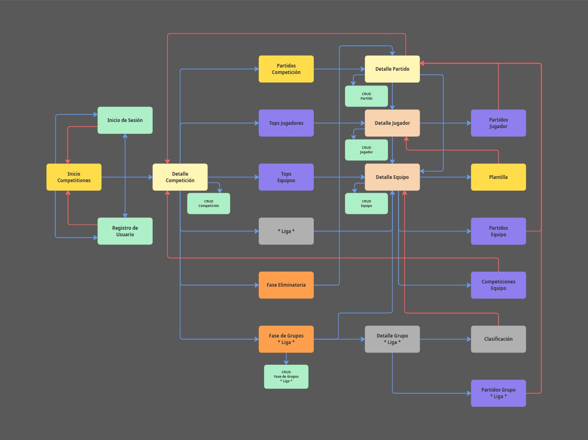

# React Native & Expo App
## Desarrollo
### 1. Instalación de requisitos

Los primeros pasos para empezar a desarrollar una App con React Native y Expo pasan por instalar Node.js junto con los paquetes requeridos para el proyecto, también, creamos una cuenta en Supabase y una en Expo, aunque esta es opcional, es muy recomendable, ya que con ella tendremos acceso a servicios como Expo Application Services (EAS).

Para poder probar nuestra App en las fases tempranas de desarrollo usamos un dispositivo físico iOS (iPhone 12 Pro) y un emulador Android (Pixel 8) con Expo Go, y posteriormente pasamos a un emulador iOS (iPhone SE) y un emulador Android (Pixel 8) con un Kit de Desarrollo, ya que algunas funcionalidades como usar otras fuentes de texto no están soportadas en Expo Go.

Puede surgir la pregunta de porqué dejamos de usar un dispositivo físico iOS y pasamos a un simulador, y la respuesta se basa en que Apple nos requerirá firmar nuestro Kit de Desarrollo para poder ejecutarlo en un dispositivo físico y para ello es necesario una cuenta de desarrollador y estar aderido al programa para desarrolladores de Apple con un coste de 100€/año.

### 2. Diseño UI / UX
Nuestro principal foco en este proyecto es tener una interfaz atractiva y simple para el usuario, para ello hemos tomado ejemplo de aplicaciones profesionales y bien posicionas en el mercado del fútbol profesoinal como son [LiveScore](https://www.livescore.com/es) y [SofaScore](https://www.sofascore.com/es-la/).

Para nuestros bocetos usamos la herramienta de diseño Figma, que nos permite agilizar y profesionalizar la maquetación de las distintas pantallas de nuestra App.

Para nuestros diagramas de navegación usamos la herramietna Miro, que nos permite crear todo tipo de diagramas de una manera intuitiva y rápida.

#### 2.1. Diagrama de Navegación
Dado el limitado tiempo del que disponemos, nuestro diagrama de navegación consta de distintas fases de desarrollo, dichas fases son las siguientes:

- Fase 1: tonos amarillos
- Fase 2: tonos naranjas
- Fase 3: tonos verdes
- Fase 4: tonos morados
- Fase 5: tonos grises

Las flechas azules indican un flujo de avance o de mismo nivel, mientras que las rojas indican un flujo de retroceso.

#### 2.2 Mockups / Bocetos de la interfaz
Dado el limitado tiempo del que disponemos, solo se han realizados los bocetos de las pantallas principales hasta la fase 2. Nuestra interfaz se divide en las siguientes pantallas principales:

**Inicio de Sesión:** pantalla de inicio de sesión.

**Inicio / Competiciones:** primera pantalla de la App después del inicio de sesión.

**Detalle Competición:** detalle de una competición en la pestaña de Clasificación para una Liga.

**Detalle Competición 2:** detalle de una competición en la pestaña de Grupos para una Copa.

**Detalle Competición 3:** detalle de una competición en la pestaña de Eliminatoria para una Copa.

**Detalle Competición 4:** detalle de una competición en la pestaña de Partidos para una Copa o Liga.

**Detalle Parido:** detalle de un partido en la pestaña de Estadísticas.

**Detalle Parido 2:** detalle de un partido en la pestaña de Alineaciones.

#### 2.3. Validación del diseño
Para comprobar la usabilidad y corregir errores compartimos estos bocetos con diferentes personas y distintos grados y ámbitos de conocimientos. Algunas de estas personas son:
 - **Diego García**, amplio conocimiento dentro del ámbito futbolítico y colaborador de [@staff19torneos](http://instagram.com/staff19torneos/).
 - **Anastasia Datsko**, desarrolladora multiplataforma, cuenta con unas bases sólidas en diseño UI/UX.
 - **Elena Guzmán**, desarrolladora multiplataforma, cuenta con unas buenas bases en paletas de colores.
 - **Adrían Lopéz**, CEO de [@staff19torneos](http://instagram.com/staff19torneos/), cliente final, cuenta con un amplio conocimiento en el mundo de los eventos deportivos. 