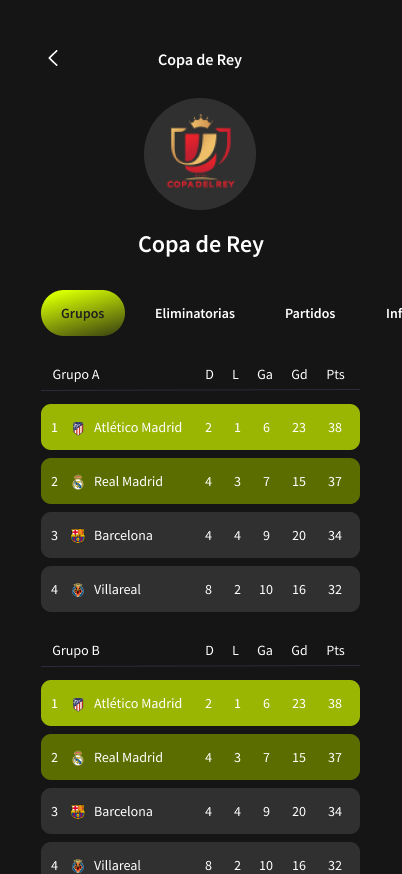
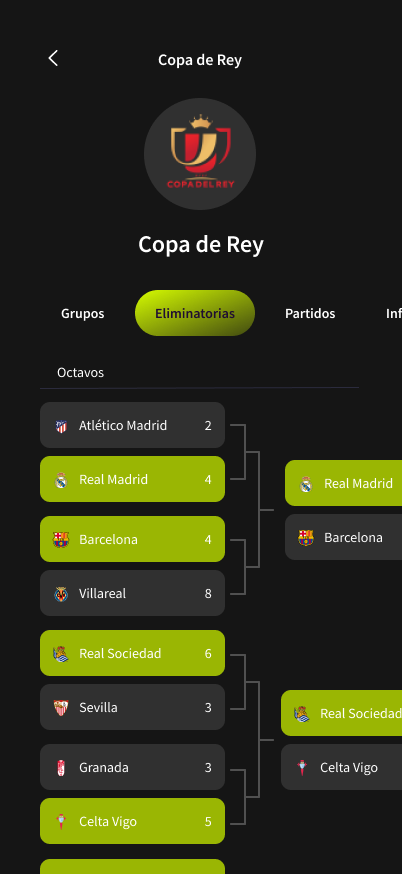
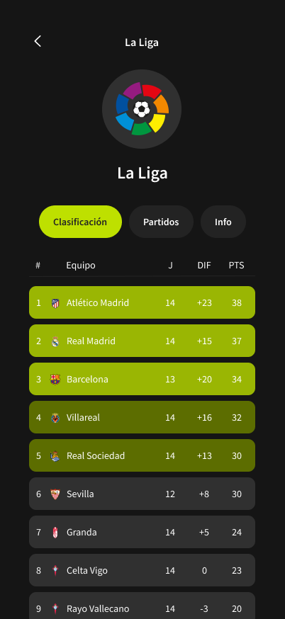
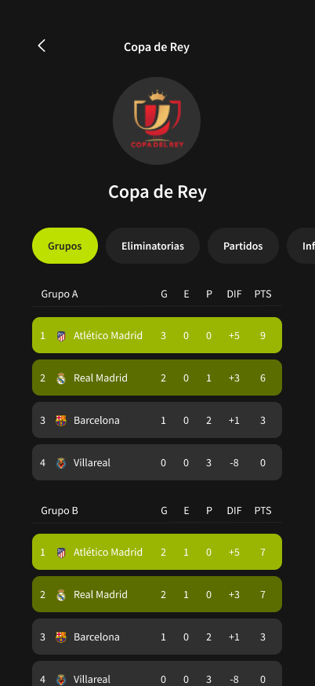
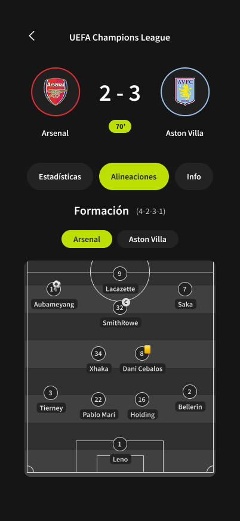

# React Native & Expo App

## Desarrollo

### 1. Instalación de requisitos

Los primeros pasos para empezar a desarrollar una App con React Native y Expo pasan por instalar Node.js junto con los paquetes requeridos para el proyecto. Además, creamos una cuenta en Supabase y una en Expo; aunque esta última es opcional, es muy recomendable, ya que con ella tendremos acceso a servicios como Expo Application Services (EAS).

Para poder probar nuestra App en las fases tempranas de desarrollo usamos un dispositivo físico iOS (iPhone 12 Pro) y un emulador Android (Pixel 8) con Expo Go. Posteriormente, pasamos a un emulador iOS (iPhone SE) y un emulador Android (Pixel 8) con un Kit de Desarrollo, ya que algunas funcionalidades, como usar otras fuentes de texto, no están soportadas en Expo Go.

Puede surgir la pregunta de por qué dejamos de usar un dispositivo físico iOS y pasamos a un simulador. La respuesta se basa en que Apple nos requerirá firmar nuestro Kit de Desarrollo para poder ejecutarlo en un dispositivo físico, y para ello es necesario una cuenta de desarrollador y estar adherido al programa para desarrolladores de Apple, con un coste de 100 €/año.

### 2. Diseño UI / UX

Nuestro principal foco en este proyecto es tener una interfaz atractiva y simple para el usuario. Para ello, hemos tomado ejemplo de aplicaciones profesionales y bien posicionadas en el mercado del fútbol profesional como son [LiveScore](https://www.livescore.com/es) y [SofaScore](https://www.sofascore.com/es-la/).

Para nuestros bocetos usamos la herramienta de diseño Figma, que nos permite agilizar y profesionalizar la maquetación de las distintas pantallas de nuestra App.

Para nuestros diagramas de navegación usamos la herramienta Miro, que nos permite crear todo tipo de diagramas de una manera intuitiva y rápida.

#### 2.1. Diagrama de Navegación

Dado el limitado tiempo del que disponemos, nuestro diagrama de navegación consta de distintas fases de desarrollo. Dichas fases son las siguientes:

-   Fase 1: tonos amarillos
-   Fase 2: tonos naranjas
-   Fase 3: tonos verdes
-   Fase 4: tonos morados
-   Fase 5: tonos grises

Las flechas azules indican un flujo de avance o de mismo nivel, mientras que las rojas indican un flujo de retroceso.

#### 2.2. Mockups / Bocetos de la interfaz

Dado el limitado tiempo del que disponemos, solo se han realizado los bocetos de las pantallas principales hasta la fase 2. Nuestra interfaz se divide en las siguientes pantallas principales:

**Inicio de Sesión:** pantalla de inicio de sesión.

**Inicio / Competiciones:** primera pantalla de la App después del inicio de sesión.

**Detalle Competición:** detalle de una competición en la pestaña de Clasificación para una Liga.

**Detalle Competición 2:** detalle de una competición en la pestaña de Grupos para una Copa.

**Detalle Competición 3:** detalle de una competición en la pestaña de Eliminatoria para una Copa.

**Detalle Competición 4:** detalle de una competición en la pestaña de Partidos para una Copa o Liga.

**Detalle Partido:** detalle de un partido en la pestaña de Estadísticas.

**Detalle Partido 2:** detalle de un partido en la pestaña de Alineaciones.

#### 2.3. Validación del diseño

Para comprobar la usabilidad y corregir errores, compartimos estos bocetos con diferentes personas con distintos grados y ámbitos de conocimiento. Algunas de estas personas y sus aportaciones son:

-   **Diego García**, amplio conocimiento dentro del ámbito futbolístico y colaborador de [@staff19torneos](https://instagram.com/staff19torneos/).
    -   Corrección de siglas y datos a mostrar en las tablas de clasificación.

        
        

-   **Anastasia Datsko**, desarrolladora multiplataforma, cuenta con unas bases sólidas en diseño UI/UX.
    -   Rediseño de la tarjeta de partido.

        

-   **Elena Guzmán**, desarrolladora multiplataforma, cuenta con unas buenas bases en paletas de colores.
    -   Cambios de color en los botones.

        

-   **Adrián López**, CEO de [@staff19torneos](https://instagram.com/staff19torneos/), cliente final, cuenta con un amplio conocimiento en el mundo de los eventos deportivos.
    -   Rediseño de las tarjetas de eliminatoria.

        

    -   Redimensión del resultado y escudos de los equipos en la pantalla de detalle partido.

        

    -   Cambios de color de la tarjeta de alineaciones.

        

### 3. Diseño de Base de Datos
El objetivo principal fue diseñar una estructura de base de datos relacional, escalable y mantenible para la gestión integral de competiciones de fútbol. Permitiéndonos manejar múltiples competiciones (liga, copa, etc.) con distintas temporadas, equipos participantes, jugadores en plantillas (con restricciones de participación), usuarios con roles diferenciados (Organizador, Árbitro, Entrenador/Capitán) y la gestión detallada de partidos y resultados.

Para ello, identificamos las siguientes entidades principales: **Usuario**, **Rol**, **Competición**, **Temporada**, **Equipo**, **Jugador**, **Partido**, **ResultadoPartido**, **FaseCompeticion**, y **GrupoCompetición**.

Las relaciones clave que establecimos fueron:

- **Competiciones → Temporadas**
   - Una competición puede tener muchas temporadas (1,N)
   - Una temporada pertenece a una única competición (1,1)

- **Usuarios ↔ Roles**
   - Un usuario puede tener 1 o varios roles (1,N)
   - Un rol puede ser asignado a 0 o varios usuarios (0,N)

- **Equipos ↔ Temporadas**
   - Un equipo puede participar en 0 o varias temporadas (0,N)
   - Una temporada puede incluir 1 o varios equipos (0,N)

- **Jugadores ↔ Equipos (por temporada)**
   - Un jugador puede estar en 0 o varios equipos (0,N)
   - Un equipo puede tener 1 o varios jugadores (1,N)

- **Temporadas → Etapas**
   - Una temporada puede tener 0 o varias etapas (0,N)
   - Una etapa pertenece a una única temporada (1,1)

- **Etapas → Grupos**
   - Una etapa puede contener 0 o varios grupos (0,N)
   - Un grupo pertenece a una única etapa (1,1)

- **Grupos ↔ Equipos (por temporada)**
   - Un grupo puede contener 3 o varios equipos (3,N)
   - Un equipo puede estar en 0 o varios grupos (0,N)

- **Temporadas → Partidos**
   - Una temporada puede tener 0 o muchos partidos (0,N)
   - Un partido pertenece a una única temporada (1,1)

- **Partidos ↔ Resultados**
   - Un partido tiene un único resultado (1,1)
   - Un resultado pertenece a un único partido (1,1)

- **Temporadas → Clasificaciones**
    - Una temporada puede tener 1 o muchas clasificaciones (1,N)
    - Una clasificación pertenece a una única temporada (1,1)

- **Usuarios → Competiciones**
    - Un usuario (organizador) puede organizar 0 o varias competiciones (0,N)
    - Una competición tiene 1 o varios organizadores (1,N)

- **Usuarios → Partidos**
    - Un usuario (árbitro) puede arbitrar 0 o varios partidos (0,N)
    - Un partido puede tener 0 o muchos árbitros (0,N)

- **Usuarios ↔ Jugadores**
    - Un usuario puede estar asociado a un único jugador o a ninguno (0,1)
    - Un jugador puede estar asociado a un único usuario o a ninguno (0,1)

- **Partidos → Equipos (local/visitante)**
    - Un partido enfrenta a un equipo local y uno visitante (1,1 cada uno)
    - Un equipo puede jugar 0 o muchos partidos (0,N)

- **Resultados → Equipos**
    - Un resultado puede tener 0 o 1 equipo ganador (0,1)
    - Un equipo puede ganar 0 o muchos partidos (0,N)

- **Clasificaciones → Equipos**
    - Una clasificación corresponde a un único equipo (1,1)
    - Un equipo puede aparecer en 0 o varias clasificaciones (0,N)

#### 3.1. Decisiones Clave y Justificación

Durante el diseño, tomamos varias decisiones importantes, razonando el porqué de cada una:

##### 3.1.1. Vinculación Equipo-Temporada vs. Equipo-Fase

Decidimos que la relación fundamental para un equipo es con la **Temporada** (a través de **EquiposTemporada**), no directamente con una Fase (**FaseCompeticion**). Las razones fueron:
-   Un equipo se inscribe y es elegible para la temporada completa.
-   Las plantillas (**PlantillasEquipo**) se definen por temporada.
-   Vincular un equipo directamente a una fase complicaría seguir su progreso a través de distintas fases (grupos, eliminatorias) y perderíamos la visión global de la temporada.

##### 3.1.2. Vinculación Partido-Temporada y Partido-Fase

Mantuvimos la relación **Partido -> Temporada** como la conexión principal. La relación **Partido -> FaseCompeticion** se consideró secundaria y opcional.
Esto asegura que todo partido esté asociado a una temporada, incluso si no pertenece a una fase específica (útil para ligas simples o partidos amistosos), dando más flexibilidad.

##### 3.1.3. Denormalización Controlada: Equipo Ganador

Analizamos si guardar explícitamente el equipo ganador en **ResultadoPartido** era redundante, ya que se puede deducir de los marcadores. Decidimos incluirlo como una **optimización de rendimiento** (denormalización controlada). Aunque introduce redundancia (que hay que gestionar para mantener la coherencia), simplifica y acelera mucho las consultas frecuentes sobre quién ganó un partido.

##### 3.1.4. Denormalización Controlada: Vínculo Directo Partido-Temporada

Incluso si asumiéramos que todo partido debe pertenecer a una fase (lo que permitiría obtener la temporada a través de **Partido -> FaseCompeticion -> Temporada**), discutimos los problemas de rendimiento que causaría eliminar la clave foránea directa **Partidos.temporada_id**.
Justificamos **mantener** esta clave foránea por **rendimiento**. Eliminarla obligaría a usar **JOIN** entre **Partidos** y **FasesCompeticion** constantemente para cualquier consulta basada en la temporada. Esto aumentaría la latencia, el consumo de recursos y la complejidad, especialmente con muchos datos. La clave foránea directa actúa como una optimización crucial para una de las consultas más comunes.

#### 3.2. Conclusión

El diseño final propone un esquema de base de datos que busca un equilibrio entre un modelo conceptualmente correcto (normalizado) y las necesidades prácticas de rendimiento y flexibilidad. Partimos de una estructura normalizada para las entidades y relaciones fundamentales, pero introdujimos denormalizaciones controladas y justificadas para optimizar las consultas críticas, asegurando al mismo tiempo que el sistema pueda gestionar diversos formatos de competición y requisitos funcionales.