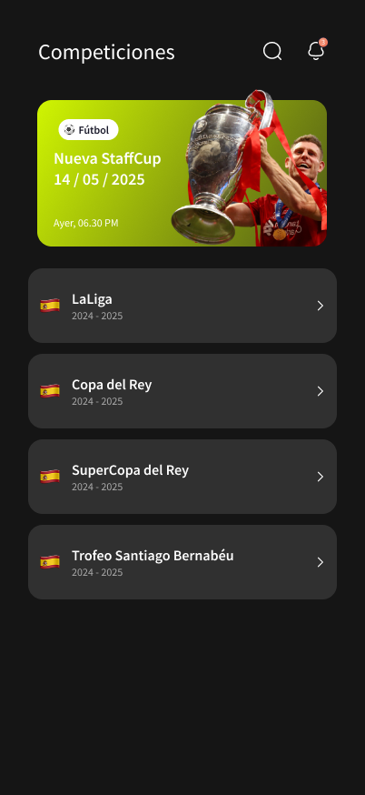
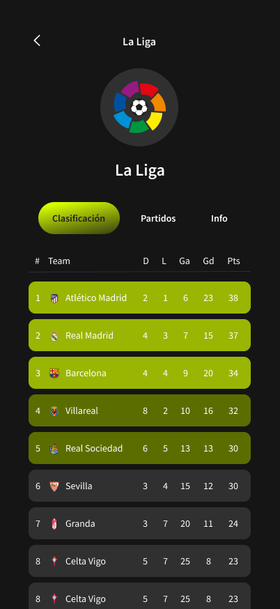
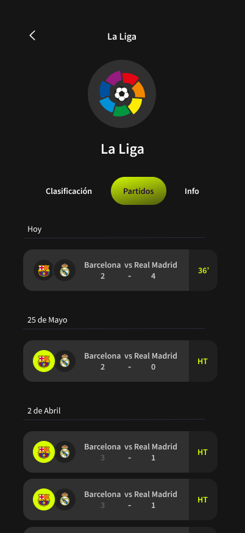
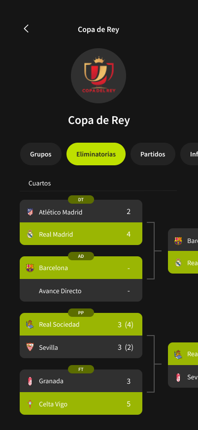
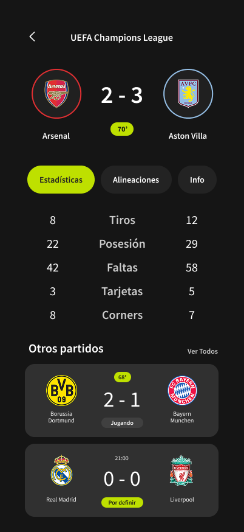
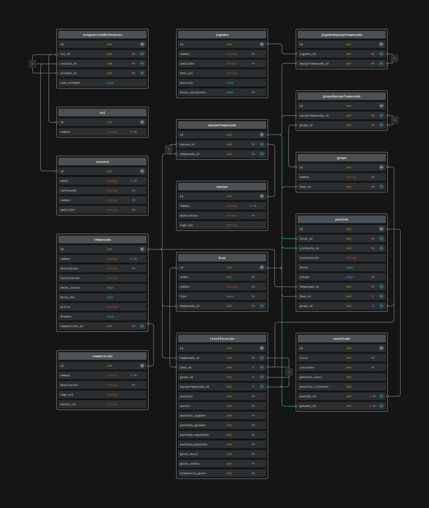

# React Native & Expo App

## Desarrollo

### 1. Instalación de requisitos

Los primeros pasos para empezar a desarrollar una App con React Native y Expo pasan por instalar Node.js junto con los paquetes requeridos para el proyecto. Además, creamos una cuenta en Supabase y una en Expo; aunque esta última es opcional, es muy recomendable, ya que con ella tendremos acceso a servicios como Expo Application Services (EAS).

Para poder probar nuestra App en las fases tempranas de desarrollo usamos un dispositivo físico iOS (iPhone 12 Pro) y un emulador Android (Pixel 8) con Expo Go. Posteriormente, pasamos a un emulador iOS (iPhone SE) y un emulador Android (Pixel 8) con un Kit de Desarrollo, ya que algunas funcionalidades, como usar otras fuentes de texto, no están soportadas en Expo Go.

Puede surgir la pregunta de por qué dejamos de usar un dispositivo físico iOS y pasamos a un simulador. La respuesta se basa en que Apple nos requerirá firmar nuestro Kit de Desarrollo para poder ejecutarlo en un dispositivo físico, y para ello es necesario una cuenta de desarrollador y estar adherido al programa para desarrolladores de Apple, con un coste de 100 €/año.

### 2. Diseño UI / UX

Nuestro principal foco en este proyecto es tener una interfaz atractiva y simple para el usuario. Para ello, hemos tomado ejemplo de aplicaciones profesionales y bien posicionadas en el mercado del fútbol profesional como son [LiveScore](https://www.livescore.com/es) y [SofaScore](https://www.sofascore.com/es-la/).

Para nuestros bocetos usamos la herramienta de diseño Figma, que nos permite agilizar y profesionalizar la maquetación de las distintas pantallas de nuestra App.

Para nuestros diagramas de navegación usamos la herramienta Miro, que nos permite crear todo tipo de diagramas de una manera intuitiva y rápida.

#### 2.1. Diagrama de Navegación

Dado el limitado tiempo del que disponemos, nuestro diagrama de navegación consta de distintas fases de desarrollo. Dichas fases son las siguientes:

-   Fase 1: tonos amarillos
-   Fase 2: tonos naranjas
-   Fase 3: tonos verdes
-   Fase 4: tonos morados
-   Fase 5: tonos grises

Las flechas azules indican un flujo de avance o de mismo nivel, mientras que las rojas indican un flujo de retroceso.

#### 2.2. Mockups / Bocetos de la interfaz

Dado el limitado tiempo del que disponemos, solo se han realizado los bocetos de las pantallas principales hasta la fase 2. Nuestra interfaz se divide en las siguientes pantallas principales:

**Inicio de Sesión:** pantalla de inicio de sesión.

**Inicio / Competiciones:** primera pantalla de la App después del inicio de sesión.

**Detalle Competición:** detalle de una competición en la pestaña de Clasificación para una Liga.

**Detalle Competición 2:** detalle de una competición en la pestaña de Grupos para una Copa.

**Detalle Competición 3:** detalle de una competición en la pestaña de Eliminatoria para una Copa.

**Detalle Competición 4:** detalle de una competición en la pestaña de Partidos para una Copa o Liga.

**Detalle Partido:** detalle de un partido en la pestaña de Estadísticas.

**Detalle Partido 2:** detalle de un partido en la pestaña de Alineaciones.

#### 2.3. Validación del diseño

Para comprobar la usabilidad y corregir errores, compartimos estos bocetos con diferentes personas con distintos grados y ámbitos de conocimiento. Algunas de estas personas y sus aportaciones son:

-   **Diego García**, amplio conocimiento dentro del ámbito futbolístico y colaborador de [@staff19torneos](https://instagram.com/staff19torneos/).
    -   Corrección de siglas y datos a mostrar en las tablas de clasificación.

        
        

-   **Anastasia Datsko**, desarrolladora multiplataforma, cuenta con unas bases sólidas en diseño UI/UX.
    -   Rediseño de la tarjeta de partido.

        

-   **Elena Guzmán**, desarrolladora multiplataforma, cuenta con unas buenas bases en paletas de colores.
    -   Cambios de color en los botones.

        

-   **Adrián López**, CEO de [@staff19torneos](https://instagram.com/staff19torneos/), cliente final, cuenta con un amplio conocimiento en el mundo de los eventos deportivos.
    -   Rediseño de las tarjetas de eliminatoria.

        

    -   Redimensión del resultado y escudos de los equipos en la pantalla de detalle partido.

        

    -   Cambios de color de la tarjeta de alineaciones.

        

# Diseño de Base de Datos para Gestión de Competiciones de Fútbol

## 3. Diseño de Base de Datos

El objetivo principal fue diseñar una estructura de base de datos relacional, escalable y mantenible para la gestión integral de competiciones de fútbol. Permitiéndonos manejar múltiples competiciones (liga, copa, etc.) con distintas temporadas, equipos participantes, jugadores en plantillas (con restricciones de participación), usuarios con roles diferenciados (Organizador, Árbitro, Entrenador/Capitán) y la gestión detallada de partidos y resultados.

Para ello, identificamos las siguientes entidades principales: **usuario**, **rol**, **competicion**, **temporada**, **equipo**, **jugador**, **partido**, **resultado**, **fase**, **grupo**, **equipoTemporada**, **jugadorEquipoTemporada** (equivalente a PlantillaEquipo), **grupoEquipoTemporada** (equivalente a GrupoEquipos) y **clasificación**. La gestión de roles y permisos se centraliza en **asignacionRolUsuario**.

_Nota sobre Roles y Permisos:_ Los roles definidos en la entidad **rol** (Organizador, Árbitro, Entrenador, Capitán, etc.) no se asignan a los usuarios de forma global. La asignación de un rol a un usuario es **contextual**, es decir, un usuario ejerce un rol sobre una entidad específica (p. ej., un usuario es Organizador *de una competicion*, o Entrenador *de un equipoTemporada*). Para gestionar esto de forma flexible y precisa, se utiliza la tabla asignacionRolUsuario que vincula usuario, rol y la entidad de contexto (tipo_entidad y entidad_id). Esta decisión se justifica en detalle en la sección 3.2.5.

Las relaciones clave que establecimos, implementadas a través de claves foráneas o tablas asociativas, fueron:

- **competicion → temporada**
    - Una competicion puede tener muchas temporada (1,N)
    - Una temporada pertenece a una única competicion (1,1)

- **equipo ↔ temporada (Implementado por equipoTemporada)**
    - Un equipo puede participar en 0 o varias temporadas (0,N)
    - Una temporada puede incluir 0 o varios equipos (0,N)

- **jugador ↔ equipoTemporada (Implementado por jugadorEquipoTemporada)**
    - Un jugador puede estar en 0 o varias inscripciones de equipoTemporada (0,N)
    - Un equipoTemporada puede tener 0 o varios jugadores (0,N)

- **temporada → fase**
    - Una temporada puede tener 0 o varias fases (0,N)
    - Una fase pertenece a una única temporada (1,1)

- **fase → grupo**
    - Una fase puede contener 0 o varios grupos (0,N)
    - Un grupo pertenece a una única fase (1,1)

- **grupo ↔ equipoTemporada (Implementado por grupoEquipoTemporada)**
    - Un grupo puede contener 0 o varios equipoTemporada (0,N)
    - Un equipoTemporada puede estar en 0 o 1 grupo dentro de la misma fase (0,1)

- **temporada → partido**
    - Una temporada puede tener 0 o muchos partidos (0,N)
    - Un partido pertenece a una única temporada (1,1)

- **partido ↔ resultado**
    - Un partido puede tener 0 o 1 único resultado si se ha jugado (0,1)
    - Un resultado pertenece a un único partido (1,1)

- **usuario → partido (Arbitra - gestionado por asignacionRolUsuario)**
    - Un usuario (árbitro) puede arbitrar 0 o varios partidos (0,N).
    - Un partido puede tener 0 o varios árbitros asignados.
    - *Implementado a través de asignacionRolUsuario donde rol_id corresponde al rol arbitral específico.*

- **partido → equipoTemporada (local/visitante)**
    - Un partido enfrenta a un equipoTemporada local y uno visitante (local_id, visitante_id en partido).
    - Un equipoTemporada puede jugar 0 o muchos partidos (0,N)

- **resultado → equipoTemporada (ganador)**
    - Un resultado puede tener 0 o 1 equipo ganador (a través del campo ganador_id en resultado).
    - Un equipoTemporada puede ganar 0 o muchos partidos (0,N)

- **clasificación ↔ temporada**
    - Un registro de clasificación pertenece a una única temporada (1,1)
    - Una temporada tiene 0 o muchos registros de clasificación (0,N)

- **clasificación ↔ fase**
    - Un registro de clasificación pertenece opcionalmente a una única fase (0,1)
    - Una fase tiene 0 o muchos registros de clasificación (0,N)

- **clasificación ↔ grupo**
    - Un registro de clasificación pertenece opcionalmente a un único grupo (0,1)
    - Un grupo tiene 0 o muchos registros de clasificación (0,N)

- **clasificación ↔ equipoTemporada**
    - Un registro de clasificación pertenece a un único equipoTemporada (1,1)
    - Un equipoTemporada puede tener 0 o muchos registros de clasificación (0,N)

#### 3.1. Modelo de Clasificación Unificado (Ligas y Grupos)

Para gestionar las tablas de clasificación de manera flexible tanto para ligas completas como para fases de grupos, se optó por una entidad (tabla) única **clasificación**. Esta tabla no representa la tabla de clasificación completa, sino **una fila individual** dentro de ella, detallando la posición y estadísticas de un equipo específico en un contexto determinado.

Los atributos clave de **clasificación** son:
- id (PK)
- temporada_id (FK a temporada, Obligatorio)
- fase_id (FK a fase, Nulable)
- grupo_id (FK a grupo, Nulable): **Diferenciador clave**. Si es NULL, la fila pertenece a la clasificación general (liga/fase). Si tiene valor, pertenece a la clasificación de ese grupo específico.
- equipoTemporada_id (FK a equipoTemporada, Obligatorio)
- posicion
- puntos
- partidos_jugados
- partidos_ganados
- partidos_empatados
- partidos_perdidos
- goles_favor
- goles_contra
- diferencia_goles

Es fundamental la restricción UNIQUE (temporada_id, fase_id, grupo_id, equipoTemporada_id) para garantizar que cada equipo tenga solo una entrada por contexto clasificatorio.

Este modelo permite consultar la clasificación de una liga (WHERE grupo_id IS NULL) o de un grupo específico (WHERE grupo_id = X) usando la misma tabla clasificación. La actualización de esta tabla se realiza tras registrar/modificar el resultado de cada partido.

#### 3.2. Decisiones Clave y Justificación

Durante el diseño, tomamos varias decisiones importantes, razonando el porqué de cada una:

##### 3.2.1. Vinculación Equipo-Temporada vs. Equipo-Fase

Decidimos que la relación fundamental para un equipo es con la **temporada** (a través de **equipoTemporada**), no directamente con una fase. Las razones fueron:
-   Un equipo se inscribe y es elegible para la temporada completa.
-   Las plantillas (gestionadas por **jugadorEquipoTemporada**) se definen por temporada.
-   Vincular un equipo directamente a una fase complicaría seguir su progreso a través de distintas fases (grupos, eliminatorias) y perderíamos la visión global de la temporada.

##### 3.2.2. Vinculación Partido-Temporada y Partido-Fase

Mantuvimos la relación **partido -> temporada** (campo temporada_id en partido) como la conexión principal. La relación **partido -> fase** (campo fase_id en partido) se consideró secundaria y opcional.
Esto asegura que todo partido esté asociado a una temporada, incluso si no pertenece a una fase específica (útil para ligas simples o partidos amistosos), dando más flexibilidad.

##### 3.2.3. Denormalización Controlada: Almacenamiento del Equipo Ganador (resultado.ganador_id)

Aunque el equipo ganador de un partido se puede derivar comparando los marcadores (goles_local, goles_visitante) y los equipos participantes, se decidió **incluir un campo ganador_id (FK a equipoTemporada.id, nullable) en la tabla resultado**.

**Justificación y Beneficios:**
- **Optimización del Rendimiento:** Consultar directamente el campo ganador_id es significativamente más rápido y eficiente que calcular el ganador mediante comparaciones y uniones (JOIN) en cada consulta que lo requiera (ej: generar clasificaciones, listar victorias de un equipo).
- **Simplificación de la Lógica:** Reduce la complejidad en la capa de aplicación y en las consultas SQL al no tener que reimplementar la lógica de determinación del ganador repetidamente.

**Compromisos:**
- **Redundancia de Datos:** Este campo introduce redundancia, ya que la información del ganador también está implícita en los marcadores.
- **Necesidad de Consistencia:** Es crucial asegurar que el valor de ganador_id sea siempre coherente con los marcadores. Esto debe gestionarse mediante lógica en la aplicación o triggers en la base de datos que actualicen ganador_id cada vez que se modifiquen los marcadores o los equipos de un resultado.

Esta denormalización es una elección deliberada para priorizar la eficiencia de las consultas para un dato frecuentemente accedido, asumiendo la responsabilidad de gestionar su consistencia.

##### 3.2.4. Denormalización Controlada: Vínculo Directo Partido-Temporada

Incluso si asumiéramos que todo partido debe pertenecer a una fase (lo que permitiría obtener la temporada a través de **partido -> fase -> temporada**), discutimos los problemas de rendimiento que causaría eliminar la clave foránea directa **partido.temporada_id**.
Justificamos **mantener** esta clave foránea por **rendimiento**. Eliminarla obligaría a usar **JOIN** entre **partido** y **fase** constantemente para cualquier consulta basada en la temporada. Esto aumentaría la latencia, el consumo de recursos y la complejidad, especialmente con muchos datos. La clave foránea directa actúa como una optimización crucial para una de las consultas más comunes.

##### 3.2.5. Gestión Contextual de Roles y Permisos (asignacionRolUsuario)

Para la asignación de roles, se descartaron enfoques como una relación M:N global usuario-rol o múltiples FKs de roles en tablas de entidad, debido a sus limitaciones en precisión contextual, flexibilidad y escalabilidad.

En su lugar, se adoptó un modelo de **asignación contextual** mediante la tabla asignacionRolUsuario. Esta tabla utiliza los campos clave usuario_id, rol_id, tipo_entidad (ENUM: 'competicion', 'equipoTemporada', 'temporada', 'partido', etc.) y entidad_id (ID de la instancia específica de tipo_entidad).

**Justificación y Beneficios:**
- **Precisión Contextual:** Permite definir con exactitud el ámbito de un rol (ej: Organizador *de esta competicion específica*, Entrenador *de este equipoTemporada concreto*).
- **Flexibilidad y Escalabilidad:** Facilita asignar múltiples roles a un usuario en diversos contextos, o múltiples usuarios a un mismo rol sobre una entidad (ej: varios Organizadores por competicion). Añadir nuevos roles o contextos es más sencillo.
- **Centralización:** La lógica para verificar permisos se centraliza en consultas a esta tabla.
- **Normalización Relativa:** Aunque la integridad referencial del campo entidad_id (que apunta a diferentes tablas según tipo_entidad) debe ser gestionada por la lógica de aplicación o triggers, este enfoque evita la proliferación de tablas de enlace específicas para cada rol y contexto, manteniendo la asignación de roles separada de las tablas de negocio principales.

Este modelo, si bien requiere una gestión cuidadosa de la integridad para entidad_id, ofrece la robustez y adaptabilidad necesarias para un sistema con una estructura de permisos compleja y variada.

#### 3.3. Diagrama relacional de la base de datos

#### 3.4. Conclusión

El diseño final propone un esquema de base de datos que busca un equilibrio entre un modelo conceptualmente correcto (normalizado) y las necesidades prácticas de rendimiento y flexibilidad. Partimos de una estructura normalizada para las entidades y relaciones fundamentales, pero introdujimos denormalizaciones controladas y justificadas (como el almacenamiento explícito del ganador_id en resultado y el vínculo directo partido.temporada_id), un modelo de clasificacion unificado, y un sistema de asignación de roles contextual (asignacionRolUsuario) para optimizar las consultas críticas, la funcionalidad y la gestión de permisos, asegurando al mismo tiempo que el sistema pueda gestionar diversos formatos de competición y requisitos funcionales complejos.