# React Native & Expo App (MatchStats19)

## 1. Introducción

El deporte constituye una actividad fundamental en la sociedad actual, no solo por su papel en la promoción de la salud física y mental, sino también por su capacidad para fomentar valores esenciales como el trabajo en equipo, la competitividad y la superación personal. Entre los deportes más populares a nivel mundial, el fútbol y el fútbol sala destacan por su amplia aceptación y participación, tanto a nivel profesional como amateur. Sin embargo, la organización de competiciones deportivas, la gestión de equipos, el registro de estadísticas y el mantenimiento actualizado de clasificaciones puede resultar una tarea compleja y tediosa, especialmente cuando se realiza manualmente o mediante herramientas poco eficientes.

En este contexto surge la necesidad de desarrollar una solución tecnológica que facilite la gestión integral de competiciones deportivas. Este proyecto tiene como objetivo desarrollar una aplicación multiplataforma (iOS, Android y web) que permita a los organizadores de competiciones gestionar equipos, jugadores, partidos y estadísticas de manera eficiente y accesible desde cualquier dispositivo. La aplicación será diseñada para cubrir las necesidades específicas de ligas de fútbol y fútbol sala, ofreciendo funcionalidades como la creación de clasificaciones automáticas, la visualización de fases de grupos y brackets eliminatorios, así como el registro detallado de estadísticas individuales y colectivas.

Con esta propuesta buscamos no solo simplificar la gestión de competiciones deportivas, sino también proporcionar una herramienta que impulse la organización y profesionalización de ligas amateur, contribuyendo así al desarrollo del deporte a nivel local, regional e incluso nacional. Es por ello que nuestro primer cliente y early adopter será [@staff19torneos](http://instagram.com/staff19torneos/), una entidad especializada en la gestión de eventos deportivos para jóvenes que desarrolla su actividad en Cabañas de la Sagra, Toledo.

## 2. Objetivos

### 2.1. Objetivo General

Desarrollar una aplicación multiplataforma (iOS, Android y web) que permita gestionar de manera integral competiciones de fútbol y fútbol sala, incluyendo la administración de equipos, jugadores, partidos, resultados y estadísticas.

### 2.2. Objetivos Específicos

- **Gestión de competiciones**:

  - Permitir la creación, visualización, edición y eliminación de competiciones deportivas.
  - Facilitar la configuración de diferentes formatos de competición (ligas, fases de grupos, brackets eliminatorios).

- **Administración de equipos y jugadores**:

  - Implementar funcionalidades para registrar y gestionar equipos participantes.
  - Permitir el registro de jugadores y su asignación a equipos específicos.

- **Registro y visualización de estadísticas**:

  - Desarrollar un sistema para registrar estadísticas básicas (goles, tarjetas, penaltis, etc.).
  - Ofrecer informes y visualizaciones claras de las estadísticas individuales y colectivas.

- **Generación automática de clasificaciones**:

  - Implementar un sistema que calcule y muestre clasificaciones actualizadas en tiempo real para competiciones tipo liga.
  - Mostrar resultados de fases de grupos y generar brackets eliminatorios dinámicos.

- **Compatibilidad multiplataforma**:

  - Garantizar que la aplicación sea accesible desde dispositivos iOS, Android y posteriormente navegadores web, asegurando una experiencia de usuario consistente en todas las plataformas.

- **Usabilidad y rendimiento**:
  - Diseñar interfaces intuitivas y fáciles de usar para usuarios con diferentes niveles de experiencia técnica.
  - Optimizar el rendimiento de la aplicación para garantizar tiempos de respuesta rápidos y una experiencia fluida.

## 3. Especificación de Requisitos

### 3.1. Requisitos Funcionales

Los requisitos funcionales describen las funcionalidades específicas que la aplicación debe ofrecer para cumplir con los objetivos del proyecto. A continuación se detallan los principales:

- **Gestión de competiciones**:

  - Crear nuevas competiciones con información básica (nombre, logo, descripción, fecha de inicio y fin, formato: liga, grupos o eliminatorias).
  - Editar y eliminar competiciones existentes.
  - Configurar diferentes formatos de competición (ligas, fases de grupos, brackets eliminatorios).

- **Administración de equipos**:

  - Registrar nuevos equipos con información básica (nombre, escudo, categoría, etc.).
  - Asignar equipos a competiciones específicas.
  - Editar o eliminar equipos registrados.

- **Administración de jugadores**:

  - Registrar jugadores con datos personales (nombre, apellidos, fecha de nacimiento, posición, etc.).
  - Asignar jugadores a equipos específicos.
  - Editar o eliminar jugadores registrados.

- **Registro de partidos y resultados**:

  - Programar partidos entre equipos dentro de una competición.
  - Registrar resultados de partidos (goles, tarjetas, etc.).
  - Actualizar automáticamente clasificaciones y estadísticas tras registrar un resultado.

- **Clasificaciones y estadísticas**:

  - Mostrar clasificaciones actualizadas en tiempo real para competiciones tipo liga.
  - Generar y visualizar brackets eliminatorios dinámicos.
  - Mostrar estadísticas individuales y colectivas (goles, tarjetas, porterías a cero, paradas, faltas, etc.).

- **Notificaciones y eventos (a futuro)**:

  - Enviar notificaciones push a los usuarios sobre eventos importantes (inicio de partidos, resultados actualizados, próximos enfrentamientos, etc.).
  - Permitir a los usuarios configurar sus preferencias de notificación.

- **Acceso multiplataforma**:
  - Garantizar que la aplicación sea accesible desde dispositivos iOS, Android y posteriormentenavegadores web.
  - Mantener consistencia en la experiencia de usuario en todas las plataformas.

### 3.2. Requisitos No Funcionales

Los requisitos no funcionales establecen características generales que afectan el rendimiento, usabilidad, seguridad y compatibilidad de la aplicación. A continuación se detallan los principales:

- **Rendimiento**:

  - La aplicación debe cargar los datos en menos de 3 segundos en condiciones normales de red.
  - Los tiempos de respuesta deben ser consistentes incluso con un número elevado de usuarios simultáneos.

- **Usabilidad**:

  - La interfaz debe ser intuitiva y fácil de usar, con un diseño limpio y accesible para usuarios con diferentes niveles de experiencia técnica.
  - Los menús y opciones deben estar organizados de forma lógica para facilitar la navegación.

- **Escalabilidad**:

  - La aplicación debe ser capaz de manejar un crecimiento significativo en el número de competiciones, equipos, jugadores y usuarios sin comprometer su rendimiento.

- **Seguridad**:

  - Implementar medidas de seguridad para proteger los datos personales de jugadores y equipos.
  - Garantizar que las conexiones entre el cliente y el servidor utilicen protocolos seguros como HTTPS bajo certificados SSL/TLS.
  - Cumplir con normativas de protección de datos aplicables, como el RGPD (Reglamento General de Protección de Datos) en la Unión Europea.

- **Compatibilidad**:

  - La aplicación debe ser compatible con las versiones más recientes de iOS y Android.
  - Debe funcionar correctamente en navegadores web modernos (Chrome, Firefox, Safari, Edge).

- **Mantenibilidad**:

  - El código debe estar bien documentado y organizado para facilitar futuras actualizaciones y mejoras.
  - Se deben seguir buenas prácticas de desarrollo (clean code, patrones de diseño, modularidad).

- **Disponibilidad (a futuro)**:

  - La aplicación debe estar disponible para los usuarios durante al menos el 99% del tiempo.
  - Implementar mecanismos de recuperación ante fallos para minimizar el tiempo de inactividad.

- **Accesibilidad (a futuro)**:
  - La aplicación debe cumplir con las pautas de accesibilidad WCAG (Web Content Accessibility Guidelines) para garantizar que sea usable por personas con discapacidades visuales, auditivas o motoras.

## 4. Planificación Temporal

### 4.1. Contexto y Limitaciones Temporales Críticas

La planificación temporal del proyecto estuvo marcada por una **restricción temporal extremadamente severa de solo 80 horas** de desarrollo efectivo, equivalente a **2 semanas** de trabajo intensivo. Esta limitación impuso decisiones drásticas en el alcance del proyecto, obligando a priorizar únicamente el desarrollo de un MVP (Producto Mínimo Viable) funcional para demostrar la viabilidad del concepto.

**Decisiones Críticas Impuestas por la Limitación Temporal:**

- Uso obligatorio de API-Football en lugar de desarrollar backend propio
- Eliminación completa de funcionalidades de administración
- Concentración exclusiva en visualización de datos
- Aplazamiento de testing exhaustivo y optimizaciones

### 4.2. Planificación Ejecutada (Versión - 80 horas)

Estructuramos la planificación real en fases ultra-condensadas, priorizando únicamente las funcionalidades esenciales para demostrar el concepto:

#### 4.2.1. Fase 1: Investigación y Análisis Acelerado (3 días - 24 horas)

- **Días 1-3**:
- Investigación intensiva sobre tecnologías disponibles (React Native, Expo, APIs externas).
- Análisis rápido de requisitos mínimos viables.
- Estudio express de casos similares y identificación de gaps.
- Definición de objetivos del MVP.
- Selección de API-Football como fuente de datos externa.

#### 4.2.2. Fase 2: Diseño y Prototipado Rápido (2 días - 16 horas)

- **Días 4-5**:
- Diseño de arquitectura frontend simplificada.
- Creación de wireframes esenciales en Figma.
- Desarrollo de mockups de pantallas principales únicamente.
- Validación rápida del diseño con cliente (@staff19torneos).

#### 4.2.3. Fase 3: Desarrollo Intensivo del MVP (6 días - 48 horas)

- **Días 6-7**:
- Configuración inicial del proyecto React Native + Expo.
- Integración básica con API-Football.
- Desarrollo de servicios de comunicación con API externa.
- **Días 8-9**:
- Implementación de pantallas principales (competiciones, detalle).
- Desarrollo del sistema de fases dinámico.
- Creación de componentes básicos reutilizables.
- **Días 10-11**:
- Implementación de visualización de clasificaciones.
- Desarrollo de vista de partidos y brackets eliminatorios.
- Integración completa de mappers de datos.

#### 4.2.4. Fase 4: Testing y Refinamiento (1 día - 8 horas)

- **Día 12**:
- Testing básico en dispositivos iOS y Android.
- Corrección de errores críticos identificados.
- Optimización básica de rendimiento.
- Ajustes finales de UI/UX.

#### 4.2.5. Fase 5: Documentación del Proyecto (2 días - 16 horas)

- **Días 13-14**:
- Redacción de documentación técnica.
- Completar el informe del TFG.
- Preparación de demo y presentación.
- Revisión final del proyecto.

#### 4.2.6. Cronograma Resumido (Versión Ejecutada)

| **Fase**                           | **Duración** | **Horas**     | **Días**      |
| ---------------------------------- | ------------ | ------------- | ------------- |
| Investigación y Análisis Acelerado | 3 días       | 24 horas      | Días 1-3      |
| Diseño y Prototipado Rápido        | 2 días       | 16 horas      | Días 4-5      |
| Desarrollo Intensivo del MVP       | 6 días       | 48 horas      | Días 6-11     |
| Testing y Refinamiento             | 1 día        | 8 horas       | Día 12        |
| Documentación del Proyecto         | 2 días       | 16 horas      | Días 13-14    |
| **TOTAL**                          | **14 días**  | **112 horas** | **2 semanas** |

### 4.3. Planificación Óptima Recomendada (Versión Ideal - 480 horas)

Para un desarrollo profesional y completo del proyecto, la planificación óptima requeriría aproximadamente **24 semanas** (480 horas de desarrollo), distribuidas de la siguiente manera:

#### 4.3.1. Fase 1: Investigación y Análisis Exhaustivo (2 semanas - 40 horas)

- **Semanas 1-2**:
- Investigación profunda de tecnologías y arquitecturas.
- Análisis detallado de requisitos funcionales y no funcionales.
- Estudio exhaustivo de competencia y benchmarking.
- Definición completa de objetivos y especificaciones.
- Creación de prototipos interactivos avanzados.

#### 4.3.2. Fase 2: Diseño de Arquitectura y UX/UI (3 semanas - 60 horas)

- **Semanas 3-5**:
- Diseño completo de arquitectura backend y frontend.
- Modelado detallado de base de datos con todas las entidades.
- Desarrollo completo de sistema de diseño y componentes.
- Creación de wireframes y mockups para todas las pantallas.
- Testing de usabilidad con usuarios reales.
- Iteración y refinamiento del diseño.

#### 4.3.3. Fase 3: Desarrollo Backend Completo (6 semanas - 120 horas)

- **Semanas 6-11**:
- Implementación completa de base de datos PostgreSQL.
- Desarrollo de APIs RESTful para todas las funcionalidades.
- Sistema completo de autenticación y autorización.
- Implementación de lógica de negocio compleja (clasificaciones, eliminatorias).
- Sistema de notificaciones en tiempo real.
- Implementación de funcionalidades administrativas.

#### 4.3.4. Fase 4: Desarrollo Frontend Avanzado (6 semanas - 120 horas)

- **Semanas 12-17**:
- Desarrollo completo de todas las pantallas y funcionalidades.
- Implementación de estado global y gestión de caché.
- Integración completa con backend propio.
- Funcionalidades offline y sincronización.
- Animaciones y micro-interacciones avanzadas.
- Optimización de rendimiento y UX.

#### 4.3.5. Fase 5: Testing y QA Exhaustivo (3 semanas - 60 horas)

- **Semanas 18-20**:
- Suite completa de pruebas unitarias y de integración.
- Testing de rendimiento y carga.
- Testing de seguridad y penetración.
- Testing de usabilidad con grupos focales.
- Testing en múltiples dispositivos y plataformas.
- Corrección de bugs y optimizaciones.

#### 4.3.6. Fase 6: Deployment y Monitorización (2 semanas - 40 horas)

- **Semanas 21-22**:
- Configuración de infraestructura de producción.
- Implementación de CI/CD y DevOps.
- Configuración de monitorización y analytics.
- Deployment en App Store y Google Play.
- Setup de sistemas de backup y recuperación.

#### 4.3.7. Fase 7: Documentación y Lanzamiento (2 semanas - 40 horas)

- **Semanas 23-24**:
- Documentación técnica completa.
- Documentación de usuario y guías.
- Preparación de material de marketing.
- Lanzamiento y estrategia de go-to-market.
- Recopilación de feedback inicial de usuarios.

#### 4.3.8. Cronograma Resumido (Versión Óptima)

| **Fase**                            | **Duración**   | **Horas**     | **Semanas** |
| ----------------------------------- | -------------- | ------------- | ----------- |
| Investigación y Análisis Exhaustivo | 2 semanas      | 40 horas      | 1-2         |
| Diseño de Arquitectura y UX/UI      | 3 semanas      | 60 horas      | 3-5         |
| Desarrollo Backend Completo         | 6 semanas      | 120 horas     | 6-11        |
| Desarrollo Frontend Avanzado        | 6 semanas      | 120 horas     | 12-17       |
| Testing y QA Exhaustivo             | 3 semanas      | 60 horas      | 18-20       |
| Deployment y Monitorización         | 2 semanas      | 40 horas      | 21-22       |
| Documentación y Lanzamiento         | 2 semanas      | 40 horas      | 23-24       |
| **TOTAL**                           | **24 semanas** | **480 horas** | **6 meses** |

### 4.4. Comparativa y Impacto de las Limitaciones

| **Aspecto**               | **Versión Ejecutada (80h)** | **Versión Óptima (480h)**   | **Impacto de la Limitación** |
| ------------------------- | --------------------------- | --------------------------- | ---------------------------- |
| **Backend**               | API externa (API-Football)  | Backend completo propio     | Dependencia externa crítica  |
| **Base de Datos**         | No implementada             | PostgreSQL completa         | Sin persistencia propia      |
| **Autenticación**         | No implementada             | Sistema completo JWT        | Sin gestión de usuarios      |
| **Testing**               | Testing básico manual       | Suite automatizada completa | Calidad no garantizada       |
| **Funcionalidades Admin** | No implementadas            | Panel completo de admin     | Solo visualización           |
| **Notificaciones**        | No implementadas            | Push notifications          | Sin engagement activo        |
| **Offline Support**       | No implementado             | Caché y sincronización      | Dependencia de conectividad  |
| **Performance**           | Optimización básica         | Optimización exhaustiva     | Posibles problemas de escala |

### 4.5. Funcionalidades Aplazadas por Limitaciones Temporales

**Funcionalidades Críticas Aplazadas:**

- Sistema completo de gestión de usuarios y roles
- Panel de administración para organizadores
- Backend propio con base de datos PostgreSQL
- Sistema de notificaciones push en tiempo real
- Funcionalidades offline y sincronización de datos
- Gestión completa de competiciones (CRUD)
- Sistema de pagos y suscripciones
- Analytics y métricas avanzadas

**Funcionalidades de Calidad Aplazadas:**

- Suite completa de testing automatizado
- Optimizaciones avanzadas de rendimiento
- Funcionalidades de accesibilidad
- Internacionalización (i18n)
- Sistema robusto de manejo de errores
- Monitorización y logging avanzado

### 4.6. Diagramas de Gantt Comparativos

#### 4.6.1. Diagrama de Gantt - Versión Ejecutada (80 horas)

El siguiente diagrama muestra la planificación extremadamente comprimida que ejecutada debido a las limitaciones temporales:

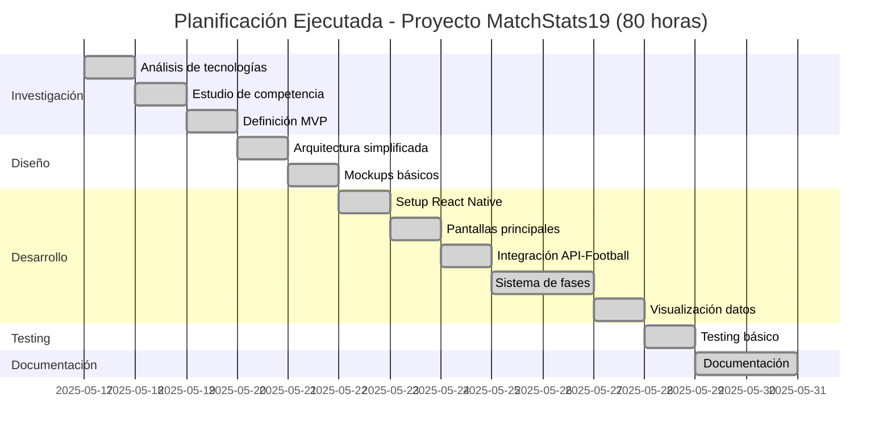

#### 4.6.2. Diagrama de Gantt - Versión Óptima (480 horas)

Este diagrama representa la planificación ideal que permitiría desarrollar un producto completo y robusto, con todas las funcionalidades necesarias para un entorno de producción:

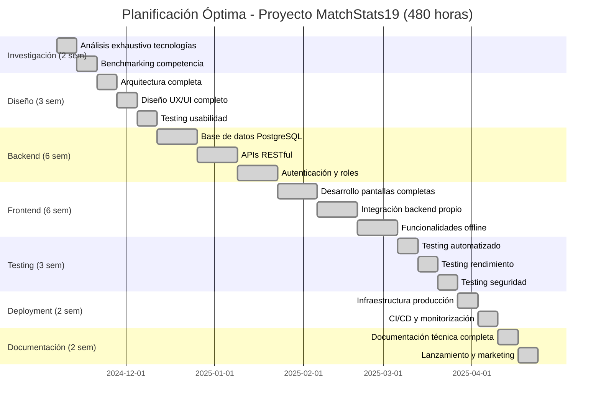

#### 4.6.3. Análisis Comparativo de los Diagramas

La comparación visual entre ambos diagramas evidencia dramáticamente el impacto de las limitaciones temporales:

**Diferencias Críticas Observadas:**

- **Duración total**: 14 días vs 24 semanas (relación 1:12)
- **Paralelización**: En la versión ejecutada, las tareas son estrictamente secuenciales debido a la falta de tiempo y recursos
- **Fases omitidas**: La versión ejecutada carece completamente de desarrollo backend, testing exhaustivo y deployment profesional
- **Calidad del testing**: 1 día vs 3 semanas de testing
- **Documentación**: 2 días vs 2 semanas para documentación completa

Esta comparación visual subraya la magnitud de las concesiones realizadas debido a las restricciones temporales extremas del proyecto.

## 5. Evaluación de Costes

El desarrollo del proyecto implica costes asociados principalmente a herramientas y recursos. A continuación se detalla una estimación aproximada:

- **Herramientas de Desarrollo**:

  - Licencias de software (IDEs, herramientas premium): **0 €** (uso de herramientas gratuitas como VS Code).
  - Servicios cloud (Supabase, hosting): **0 €/mes** (versión gratuita de Supabase).
  - Publicación en AppStore: **100€/año**

- **Tiempo de Desarrollo**:

  - Tiempo dedicado: **2 semanas**.
  - Esfuerzo estimado: **40 horas/semana**.

- **Costes Totales**:
  - Coste total aproximado: **100 €**.

## 6. Tecnologías

### 6.1. React Native

React Native es un framework de desarrollo de aplicaciones móviles multiplataforma desarrollado por Meta (anteriormente Facebook) que permite construir aplicaciones nativas para sistemas operativos como iOS, Android, Windows, MacOS, etc. utilizando JavaScript y el paradigma declarativo de componentes (una extensión de React, una librería para desarrollo web).

A diferencia de otras tecnologías, React Native compila el código JavaScript en componentes nativos, lo que permite que las aplicaciones conserven un rendimiento y experiencia de usuario muy similar a los de una app 100% nativa.

Las razones por las que podemos considerar a React Native como la mejor o una de las mejores soluciones se resumen en:

- **Eficiencia en el Desarrollo Multiplataforma**: desarrollo de aplicaciones web, iOS, Android, Windows y MacOS desde un único código base. Reduce significativamente el tiempo y los recursos necesarios.

- **Rendimiento Cercano al Código Nativo**: aunque no es tan rápido como el desarrollo nativo, ha demostrado ser capaz de ofrecer un rendimiento cercano en la mayoría de los escenarios.

- **Comunidad Activa y Ecosistema Robusto**: cuenta con una comunidad global de desarrolladores extremadamente activa, lo que asegura un flujo constante de bibliotecas, herramientas y soluciones open source.

- **Adaptabilidad a Nuevas Tecnologías**: el mundo tecnológico en 2025 estará dominado por innovaciones como la inteligencia artificial, la realidad aumentada y la conectividad 5G/6G. React Native, gracias a su flexibilidad y capacidad para interactuar con APIs nativas, es altamente adaptable a estas nuevas tecnologías.

- **Soporte Empresarial y Adopción Generalizada**: ha sido adoptado por numerosas empresas líderes en diversos sectores, como Meta, Shopify, Tesla, y Discord, lo que demuestra su viabilidad para proyectos a gran escala.

Como dato a destacar, a fecha de 2023 **React Native se encuentra en 6 de cada 10 apps publicadas** en las stores mientras que Flutter (su competidor más directo) se encuentra en 2 de cada 10.

### 6.2. Expo

Expo es un framework construido sobre React Native que representa una solución integral y eficiente para el desarrollo de aplicaciones móviles multiplataforma. Su enfoque zero-config, combinado con una amplia gama de APIs preconstruidas, herramientas de desarrollo avanzadas y servicios de compilación en la nube, lo convierte en una opción ideal para equipos que buscan optimizar el tiempo, los recursos y la calidad del producto final.

Las razones por las que Expo es una opción a considerar para construir proyectos se resumen en:

- **Simplificación del Proceso de Desarrollo**: una de las principales ventajas de Expo es su capacidad para reducir significativamente la curva de aprendizaje y el tiempo necesario para iniciar un proyecto.

- **Amplia Gama de APIs Preconstruidas**: ofrece un ecosistema completo de APIs preconfiguradas que permiten acceder a funciones nativas del dispositivo, como la cámara, el GPS, las notificaciones push, el almacenamiento local y más, sin necesidad de escribir código nativo.

- **Compilación en la Nube y Distribución Simplificada**: ofrece servicios de compilación en la nube a través de su plataforma EAS Build, lo que elimina la necesidad de instalar herramientas nativas como Xcode o Android Studio en el equipo local.

- **Herramientas de Desarrollo Avanzadas**: incluye herramientas de desarrollo avanzadas que mejoran la productividad y la experiencia del desarrollador como **Expo Go**.

- **Compatibilidad con React Native Bare Workflow**: aunque está diseñado para ser una solución plug-and-play, también ofrece compatibilidad con el flujo de trabajo "bare" de React Native, lo que permite acceder directamente al código nativo.

- **Soporte Continuo y Actualizaciones Regulares**: cuenta con un equipo dedicado de desarrolladores y una comunidad activa que garantizan actualizaciones regulares y soporte continuo.

- **Costo-Beneficio Competitivo**: puede reducir significativamente los costos asociados con el desarrollo móvil, especialmente para equipos pequeños o proyectos con presupuestos limitados.

### 6.3. Supabase

Supabase es una plataforma de backend como servicio (BaaS) de código abierto que proporciona una infraestructura completa para el desarrollo de aplicaciones modernas. Muy inspirada en Firebase, Supabase se basa en tecnologías robustas como PostgreSQL, ofreciendo una base de datos relacional escalable, autenticación integrada, almacenamiento de archivos, funcionalidades en tiempo real y APIs RESTful/GraphQL automáticas.

La arquitectura de Supabase está diseñada para ser flexible, segura y fácil de integrar con cualquier aplicación frontend, lo que la convierte en una solución ideal para desarrolladores que buscan un backend potente sin la necesidad de gestionar servidores o configuraciones complejas. Además, su naturaleza open source permite a los desarrolladores personalizar y extender la plataforma según sus necesidades específicas.

Las razones por las que Supabase es una opción a considerar para construir el backend se resumen en:

- **Base de Datos Relacional Potente**: una de las principales ventajas de Supabase es su uso de PostgreSQL como motor de base de datos subyacente. PostgreSQL es una de las bases de datos relacionales más avanzadas y confiables del mercado, conocida por su rendimiento, escalabilidad y soporte para características avanzadas como transacciones ACID, índices personalizados, funciones avanzadas de consulta y extensiones.

- **Autenticación y Seguridad Integradas**: proporciona un sistema de autenticación listo para usar que incluye soporte para múltiples métodos de inicio de sesión, como correo electrónico/contraseña, proveedores OAuth (Google, GitHub, etc.) y autenticación mediante tokens JWT. Supabase garantiza que las aplicaciones cumplan con los estándares más estrictos de seguridad, legislación y protección de datos, lo que elimina la necesidad de implementar sistemas personalizados reduciendo el riesgo de errores de seguridad y acelerando el desarrollo.

- **APIs Automáticas y Flexibles**: genera automáticamente APIs RESTful y GraphQL basadas en la estructura de la base de datos PostgreSQL. Esto permite a los desarrolladores acceder y manipular datos desde el frontend de manera sencilla y eficiente, sin necesidad de escribir controladores o endpoints manualmente.

- **Funcionalidades en Tiempo Real**: incluye soporte nativo para funcionalidades en tiempo real mediante WebSockets, permitiendo a las aplicaciones recibir actualizaciones instantáneas de la base de datos sin necesidad de realizar consultas periódicas. Esta capacidad es esencial para aplicaciones modernas como chats, tableros colaborativos, juegos en línea y plataformas de monitoreo en tiempo real.

- **Almacenamiento de Archivos y Procesamiento**: ofrece un sistema de almacenamiento de archivos integrado que permite cargar, descargar y gestionar archivos multimedia (imágenes, videos, documentos, etc.) directamente desde la base de datos. Este sistema es compatible con servicios de almacenamiento en la nube como AWS S3, lo que garantiza escalabilidad y rendimiento óptimo.

- **Código Abierto y Comunidad Activa**: uno de los aspectos más destacados de Supabase es su naturaleza open source. A diferencia de soluciones propietarias como Firebase, Supabase permite a los desarrolladores inspeccionar, modificar y extender el código base según sus necesidades específicas.

- **Escalabilidad y Costo-Beneficio**: está diseñado para escalar horizontalmente, lo que significa que puede manejar crecientes volúmenes de datos y usuarios sin comprometer el rendimiento. Desde el punto de vista económico, Supabase ofrece planes gratuitos y de pago flexibles, lo que lo hace accesible para startups, pequeñas empresas y proyectos personales. Además, al eliminar la necesidad de gestionar servidores o contratar equipos dedicados de DevOps, Supabase reduce significativamente los costos operativos asociados con el desarrollo y mantenimiento de un backend personalizado.

### 6.4. API-Football para Datos de Demostración

Para la implementación de la aplicación de demostración optamos por [API-Football](https://www.api-football.com/) como fuente de datos externos. Tomamos esta decisión considerando que en el tiempo reducido disponible y con los conocimientos actuales, no era viable construir completamente el backend y la base de datos necesarios para este proyecto.

API-Football proporciona:

- Datos en tiempo real de más de 1000 competiciones mundiales
- Información completa de equipos, jugadores, partidos y clasificaciones
- Estructura de datos consistente y bien documentada
- Plan gratuito con 100 peticiones/día para desarrollo y demostración
- Planes de pago desde 19$/mes con más de 7000 peticiones/día para desarrollo, demostración y producción

Esta aproximación permite demostrar parte de todas las funcionalidades de la aplicación con datos reales y actualizados, mientras que la arquitectura de base de datos (sección 8) representa la implementación ideal para un sistema de producción completo.

## 7. Casos de Éxito

### 7.1. Xporty

[Xporty](https://www.xporty.com/) se define como "El más completo programa para organizar y gestionar ligas y torneos online", se caracteriza por ahorrar tiempo a los organizadores, ofrecer una imagen profesional y aumentar el éxito de las competiciones gracias a su facilidad de uso, sus múltiples deportes y formatos.

Su foco principal de clientes radica en los jugadores de padel o tenis, pero su plataforma está enfocada a todo tipo de deportes como puede ser el fútbol. Podemos ver un buen ejemplo de uso en Alberto Messia, organizador de la [Liga Fútbol Sala Toledo (LFST)](https://www.ligafutbolsalatoledo.com/) y colaborador en proyectos con [@staff19torneos](http://instagram.com/staff19torneos/).

Xporty ofrece una gran variedad de servicios, desde hospedar eventos en su página web y app hasta webs y apps personalizadas para cada organización, a precios asequibles según número de equipos.

### 7.2. MyGol

[MyGol](https://mygol.es/) se define como "Un software de gestión deportiva diseñado por y para organizadores de ligas". MyGol nace por la falta de una herramienta integral en el mercado que cubra las necesidades de los organizadores y elimine horas de trabajo. MyGol se caracteriza por facilitar las labores y tareas de los organizadores y de los delegados de equipos, evitando el desgaste que puede llegar a provocar las responsabilidades administrativas y económicas.

Su foco principal de clientes radica en las competiciones futbolísticas, es por ello que ha sido construido pensando en los jugadores y equipos de fútbol, permitiendo la gestión de credenciales, pagos internos, notificaciones, seguimiento de la liga y sistema de logros, todo en una sola aplicación. Un buen ejemplo de uso es el [CD Illescas](https://cdillescas.es/) que organiza y gestiona sus torneos veraniegos a través de MyGol.

### 7.3. Winner

[Winner](https://winner-9bee4.firebaseapp.com/es/) se define como "organizador de torneos, campeonatos, ligas, copas, eliminatorias y playoffs", es un software menos profesional y especializado que los ejemplos previos, pero destaca por su gran capacidad a pesar de su sencillez.

Su foco principal de clientes radica en usuarios menos profesionales y en muchos tipos distintos de deportes (desde eSports hasta tradicionales), por ejemplo, una torneo de fútbol entre amigos o un torneo online de Fórmula 1. Aunque todo esto no es impedimento para cubrir las necesidades básicas de organizaciones profesionales, es por ello que la [Liga Local de Bargas](https://www.instagram.com/liga_local_bargas/) ha usado esta aplicación en distintas ocasiones para gestionar ligas y copas.

Como principales desventajas de Winner está la imposibilidad de acceder a la plataforma desde un navegador web, ya que solo cuenta con versiones iOS y Android.

Si buscamos algo sencillo y rápido Winner es la mejor opción, además de ser la más asequible. Pero si buscamos automatizar inscripciones, guardar estadísticas de equipos o jugadores, redactar actas de partido, controlar sanciones, etc. Winner no es el software indicado, ya que no cubre dichas necesidades.

### 7.4. Toornament

[Toornament](https://www.toornament.com/es/) se define como "Todo lo que necesitas para tu competición de eSports" y se caracteriza, como su nombre indica, por su enfoque en eSport. Pese a ello, soporta otros tipos de deportes de manera genérica gracias a su buena estructuración y construcción.

Como ya hemos indicado previamente, su foco principal de clientes son los organizadores de eventos eSports, destacándose por sus integraciones con distintos videojuegos como League Of Legends o Valorant. Un buen caso de uso es [Fullwipe](https://play.toornament.com/es/circuits/6887473416242782208/) que gestiona su competición de Splatoon desde Toornament.

Una de las ventajas de Toornament es su buena estructuración y construcción, lo que les permite ofrecer una API para desarrolladores por 590€/mes y les permite alojar cualquier tipo de deporte, sea eSport o tradicional, pudiendo personalizar casi cualquier aspecto necesario de la competición, como pueden ser las reglas de desempate en cualquier fase de la competición.

Además, cuenta con planes mucho más económicos que Xporty o MyGol, aunque no cuenta con una App ni notificaciones en tiempo real sobre los eventos de partido.

## 8. Desarrollo e Implementación

### 8.1. Instalación de Requisitos

Los primeros pasos para empezar a desarrollar una aplicación con React Native y Expo requieren la instalación de Node.js junto con los paquetes necesarios para el proyecto. Además, de una cuenta en Supabase y Expo; aunque esta última es opcional, es muy recomendable ya que proporciona acceso a servicios como Expo Application Services (EAS).

Para las tareas de debug y testeo de la aplicación recurrimos a la App "Expo Go" proporcionada por Expo en emuladores iOS y Android y en dispositivos físicos iOS y Android.

Existen otras opciones para realizar las tareas de debug y testeo, como puede ser el "Kit de Desarrollo" de Expo, pero debido a su complejidad con respecto a "Expo Go" no era viable en este proyecto.

### 8.2. Diseño UI / UX

El principal foco en este proyecto ha sido contar con una interfaz atractiva y simple para el usuario. Para ello, tomamos ejemplo de aplicaciones profesionales y bien posicionadas en el mercado del fútbol profesional como son [LiveScore](https://www.livescore.com/es) y [SofaScore](https://www.sofascore.com/es-la/).

Para los bocetos utilizamos la herramienta de diseño Figma, que permite agilizar y profesionalizar la maquetación de las distintas pantallas de la aplicación.

Para los diagramas de navegación utilizamos la herramienta Miro, que permite crear todo tipo de diagramas de una manera intuitiva y rápida.

#### 8.2.1. Diagrama de Navegación

Dado el limitado tiempo disponible, el diagrama de navegación consta de distintas fases de desarrollo. Dichas fases son las siguientes:

- Fase 1: tonos amarillos
- Fase 2: tonos naranjas
- Fase 3: tonos verdes
- Fase 4: tonos morados
- Fase 5: tonos grises

Las flechas azules indican un flujo de avance o de mismo nivel, mientras que las rojas indican un flujo de retroceso.

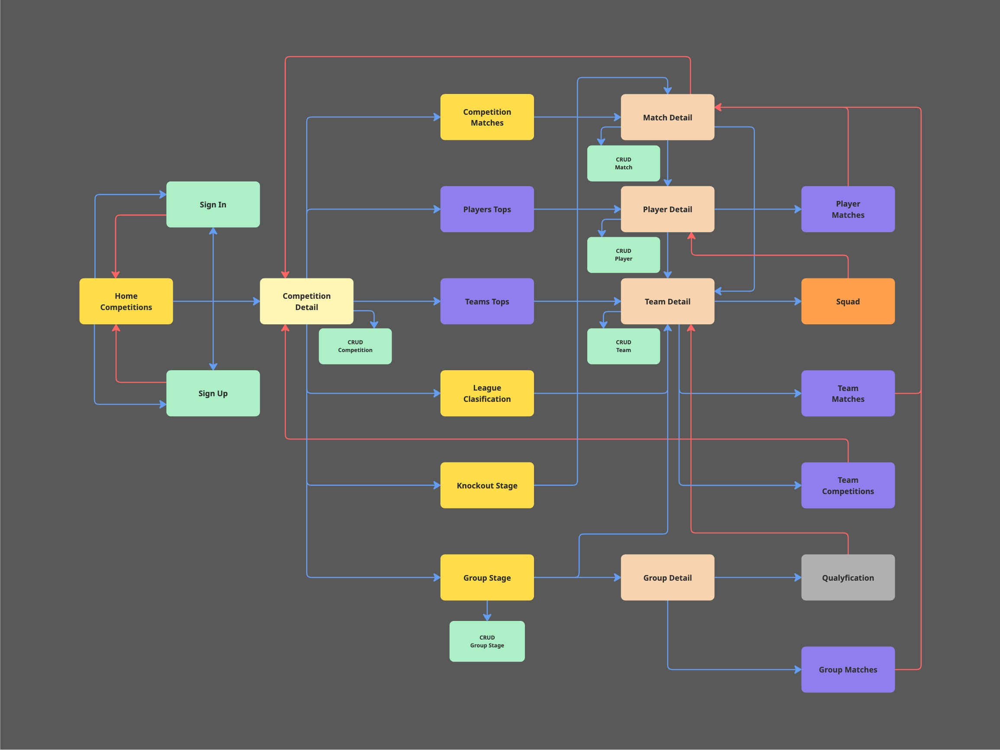

#### 8.2.2. Mockups / Bocetos de la Interfaz

Dado el limitado tiempo disponible, solo realizamos los bocetos de parte del proyecto. La interfaz se divide en las siguientes pantallas:

**Inicio de Sesión:** pantalla de inicio de sesión.

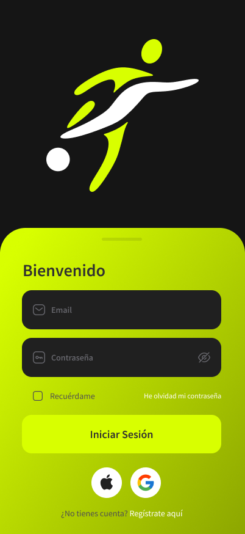

**Inicio / Competiciones:** pantalla de inicio de la aplicación.

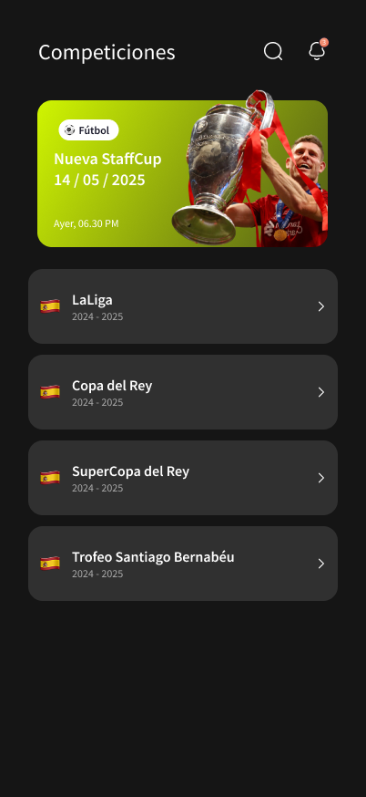

**Detalle Competición:** detalle de una competición en la pestaña de Clasificación para una Liga.

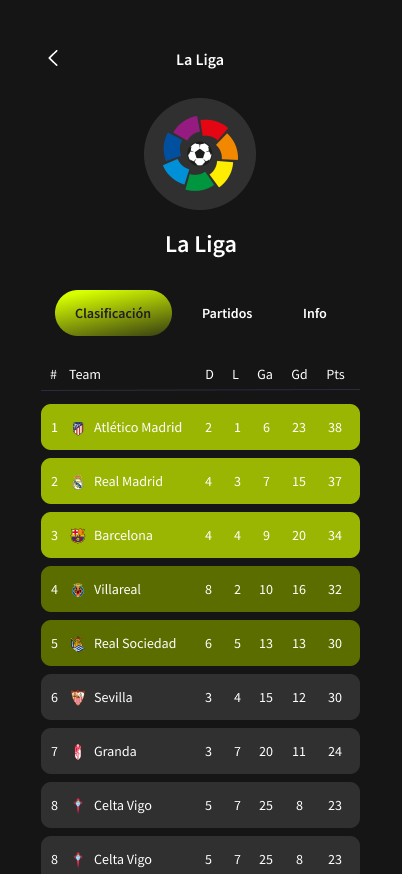

**Detalle Competición 2:** detalle de una competición en la pestaña de Grupos para una Copa.

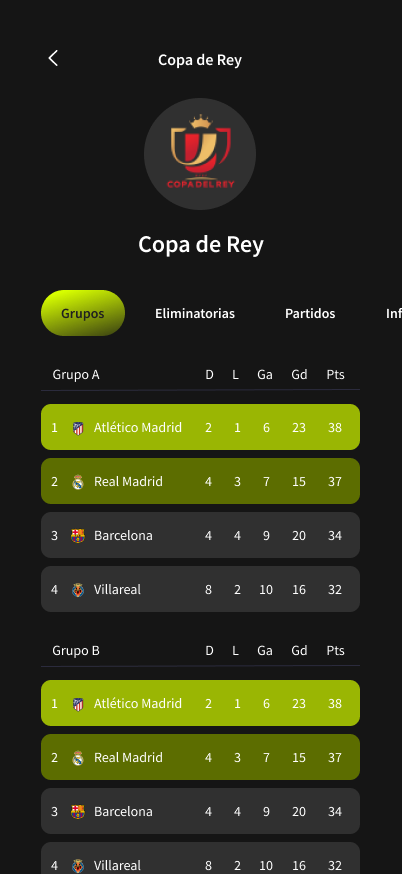

**Detalle Competición 3:** detalle de una competición en la pestaña de Eliminatoria para una Copa.

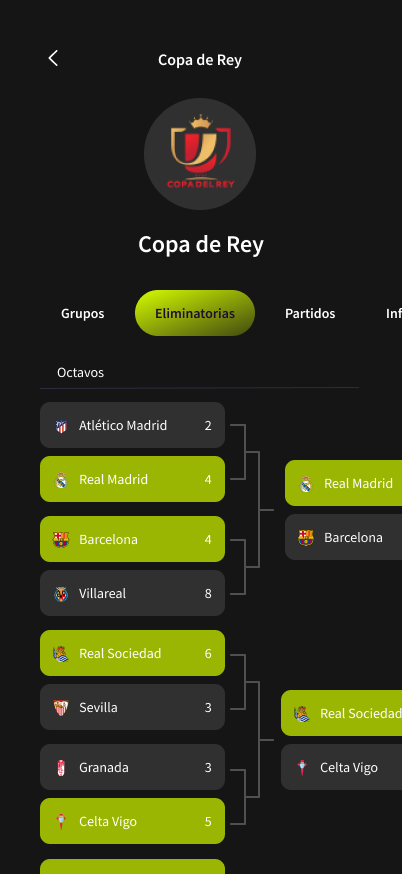

**Detalle Competición 4:** detalle de una competición en la pestaña de Partidos para una Copa o Liga.

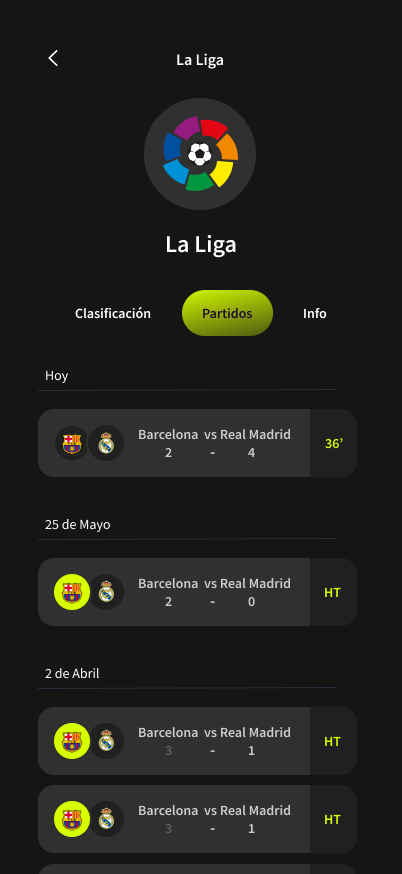

**Detalle Partido:** detalle de un partido en la pestaña de Estadísticas.

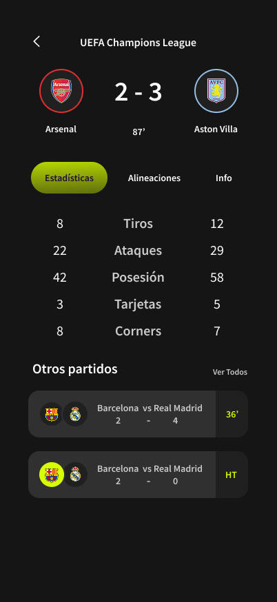

**Detalle Partido 2:** detalle de un partido en la pestaña de Alineaciones.

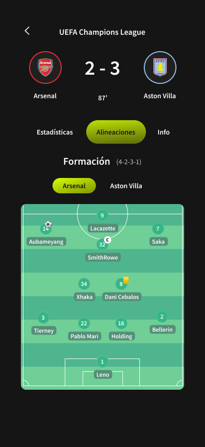

#### 8.2.3. Validación del Diseño

Para comprobar la usabilidad y corregir errores, compartimos estos bocetos con diferentes personas con distintos grados y ámbitos de conocimiento. Algunas de estas personas y sus aportaciones fueron:

- **Diego García**, amplio conocimiento dentro del ámbito futbolístico y colaborador de [@staff19torneos](https://instagram.com/staff19torneos/).

  - Corrección de siglas y datos a mostrar en las tablas de clasificación.
    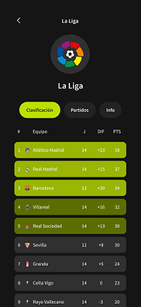
    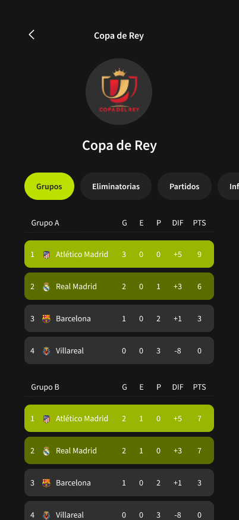

- **Anastasia Datsko**, desarrolladora multiplataforma, cuenta con unas bases sólidas en diseño UI/UX.

  - Rediseño de la tarjeta de partido.
    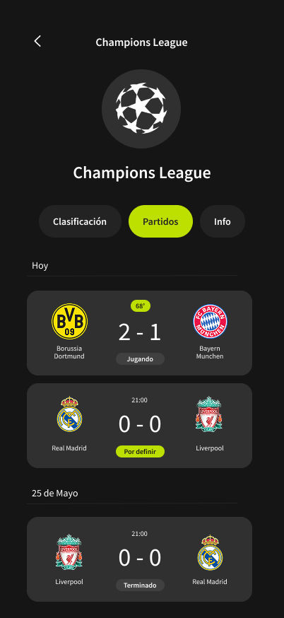

- **Elena Guzmán**, desarrolladora multiplataforma, cuenta con buenas bases en paletas de colores.

  - Cambios de color en los botones.
    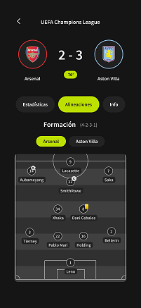

- **Adrián López**, CEO de [@staff19torneos](https://instagram.com/staff19torneos/), cliente final, cuenta con un amplio conocimiento en el mundo de los eventos deportivos.
  - Rediseño de las tarjetas de eliminatoria.
    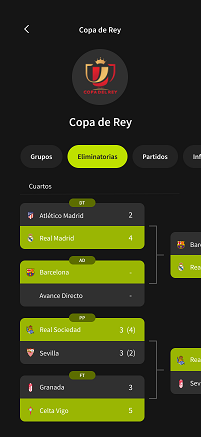
  - Redimensión del resultado y escudos de los equipos en la pantalla de detalle partido.
    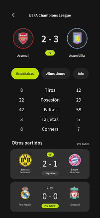
  - Cambios de color de la tarjeta de alineaciones.
    

### 8.3. Implementación con React Native + TypeScript

Estructuramos el proceso de desarrollo e implementación de la aplicación siguiendo las mejores prácticas de desarrollo React Native con Expo, priorizando la modularidad del código, la reutilización de componentes y una arquitectura escalable. La implementación se divide en varias capas bien diferenciadas que permiten un mantenimiento eficiente y una expansión futura del proyecto.

#### 8.3.1. Arquitectura del Proyecto

**Estructura de Carpetas y Organización**

La aplicación sigue una arquitectura basada en capas con separación clara de responsabilidades:

    src/
    ├── app/                # Navegación de la aplicación
    ├── components/         # Componentes reutilizables
    │   ├── ui/             # Componentes de interfaz genéricos
    │   └── icons/          # Iconos de la aplicación
    ├── constants/          # Constantes de la aplicación
    ├── hooks/              # Custom hooks para lógica de negocio
    ├── mappers/            # Transformadores de datos de APIs
    ├── screens/            # Pantallas principales de la aplicación
    ├── services/           # Servicios para comunicación con APIs
    ├── theme/              # Estilos y temas de la aplicación
    ├── types/              # Definiciones de tipos TypeScript
    └── utils/              # Utilidades y funciones auxiliares

Esta estructura facilita la localización del código, mejora la mantenibilidad y permite a múltiples desarrolladores trabajar en paralelo sin conflictos.

**Patrón de Diseño Implementado**

Adoptamos un patrón **Presentational/Container Components** combinado con **Custom Hooks** para la gestión del estado y la lógica de negocio:

- **Componentes Presentacionales**: Se encargan únicamente de la renderización y reciben datos via props.
- **Custom Hooks**: Centralizan la lógica de negocio, gestión de estado y comunicación con APIs.
- **Servicios**: Abstraen la comunicación con APIs externas y transformación de datos.

**Gestión de Estado**

Para la gestión de estado optamos por una combinación de:

- **React Hooks** (`useState`, `useEffect`, `useMemo`) para estado local de componentes.
- **Custom Hooks** para lógica compartida entre componentes.
- **Context API** para estado global cuando es necesario.

Esta aproximación evita la complejidad innecesaria de librerías como Redux para un proyecto de este tamaño, manteniendo la simplicidad sin sacrificar funcionalidad.

#### 8.3.2. Integración con APIs Externas

**Implementación del Servicio de Fútbol**

Desarrollamos una clase `FootballService` que centraliza todas las comunicaciones con la API externa:

    class FootballService {
      private headers: Record<string, string>;

      async getCompetitionData(competitionId: string): Promise<Competition | null>
      async getMatches(params: MatchParams): Promise<Match[]>
      async getStandings(league: number, season: number): Promise<StandingEntry[]>
      // ... otros métodos
    }

Características principales del servicio:

- **Gestión de Errores**: Manejo robusto de errores de red y respuestas inválidas.
- **Transformación de Datos**: Conversión automática de formatos de API a tipos internos.

**Mappers de Transformación de Datos**

Para mantener la independencia entre el formato de datos de la API externa y la estructura interna de la aplicación, implementamos mappers especializados. Esta capa de abstracción permite:

- **Flexibilidad**: Cambiar de proveedor de API sin afectar el resto de la aplicación.
- **Consistencia**: Garantizar tipos de datos uniformes en toda la aplicación.
- **Validación**: Verificar y limpiar datos antes de su uso interno.

#### 8.3.3. Gestión Inteligente de Fases de Competición

**Problemática Inicial**

Una de las mayores complejidades del proyecto ha sido la gestión unificada de diferentes tipos de competiciones:

- **Ligas**: Formato de todos contra todos (La Liga, Premier League).
- **Copas**: Combinación de fases de grupos y eliminatorias (Champions League, Copa del Rey).
- **Competiciones Mixtas**: Formatos híbridos o especiales.

Cada tipo requiere una presentación y organización de datos diferente, pero la API externa no proporciona esta estructura organizada.

**Solución Implementada: Sistema de Fases Dinámico**

Desarrollamos un sistema inteligente que analiza los datos de cada competición y los organiza en fases apropiadas:

    private async buildOrganizedPhases(
      leagueId: number,
      season: number,
      competitionType: string,
      allMatches: Match[],
      standings: StandingEntry[],
      rounds: string[],
      teams: Team[]
    ): Promise<CompetitionPhase[]>

Algoritmo de Clasificación:

- **Determinación del Tipo**: Análisis del ID de competición para clasificar automáticamente.
- **Filtrado de Rondas**: Separación de partidos según patrones de nombres de ronda.
- **Construcción de Fases**: Creación de estructuras de datos apropiada para cada tipo.

Ejemplos de Clasificación:

    // Liga tradicional - todos los partidos van a una fase
    if (competitionType === "league") {
      const leaguePhase: LeaguePhase = {
        id: `${leagueId}-${season}-league`,
        name: "Liga",
        type: "league",
        matches: allMatches,
        standings: standings,
      };
    }
    // Copa - separación en fases de grupos y eliminatorias
    else if (competitionType === "cup") {
      const leagueMatches = allMatches.filter(match =>
        this.isLeaguePhaseRound(match.round)
      );
      const knockoutMatches = allMatches.filter(match =>
        this.isKnockoutPhaseRound(match.round)
      );
      // ... construcción de fases específicas
    }

**Filtrado de Rondas**

Implementamos métodos especializados para la clasificación automática de rondas:

Para Fases de Liga/Grupos:

- Reconocimiento de patrones como "Regular Season", "League Stage", "Group A", etc.
- Detección de rondas numeradas (1, 2, 3, ...).

Para Fases Eliminatorias:

- Identificación de "Qualifying Rounds", "Round of 16", "Quarter-finals", etc.
- Soporte para múltiples formatos de nomenclatura.

Esta inteligencia permite que la aplicación se adapte automáticamente a diferentes formatos de competición sin intervención manual.

#### 8.3.4. Interfaz de Usuario Adaptativa

**Sistema de Navegación por Pestañas Dinámico**

La interfaz se adapta dinámicamente según el tipo de competición y las fases disponibles:

    export const generateViewOptions = (
      selectedSeason: Season | null,
      knockoutView: KnockoutViewType
    ): TabOption[] => {
      const options: TabOption[] = [];

      // Partidos - siempre disponible
      if (hasMatches(selectedSeason)) {
        options.push({ id: "matches", label: "Partidos", component: Matches });
      }

      // Opciones específicas según tipo de competición
      if (selectedSeason?.phases) {
        const hasGroups = selectedSeason.phases.some(phase => phase.type === "groups");
        const hasKnockouts = selectedSeason.phases.some(phase => phase.type === "knockout");
        const hasLeague = selectedSeason.phases.some(phase => phase.type === "league");

        // Agregar pestañas según disponibilidad
        if (hasGroups) options.push({ id: "groups", label: "Grupos", component: Groups });
        if (hasLeague && hasStandings) options.push({ id: "standings", label: "Clasificación", component: Standings });
        if (hasKnockouts) options.push({ id: "knockouts", label: "Eliminatorias", component: KnockoutComponent });
      }

      return options;
    };

**Vistas Especializadas para Eliminatorias**

Para las fases eliminatorias implementamos dos vistas diferenciadas:

- **Vista Lista**: Muestra todas las rondas eliminatorias de forma secuencial.

  - Qualifying rounds, octavos, cuartos, semifinales, final.
  - Ideal para seguimiento detallado del progreso.

- **Vista Brackets**: Visualización de las rondas finales.

  - Solo semifinales y final para máxima claridad.
  - Diseño inspirado en brackets deportivos profesionales.

  const filterRoundsForBrackets = (rounds: KnockoutRound[]): KnockoutRound[] => {
  return rounds.filter(round => {
  const roundName = round.name.toLowerCase();

      // Excluir rondas anteriores a semifinales
      const excludePatterns = ['quarter', '1/4', 'round of 16', '1/8', 'qualifying'];
      const shouldExclude = excludePatterns.some(pattern => roundName.includes(pattern));

      if (shouldExclude) return false;

      // Incluir solo semifinales y final
      const includePatterns = ['semi-final', 'semifinals', '1/2'];
      const isSemi = includePatterns.some(pattern => roundName.includes(pattern));
      const isFinal = roundName === 'final';

      return isSemi || isFinal;

  });
  };

**Componentes Reutilizables**

Desarrollamos una librería de componentes reutilizables que mantiene consistencia visual en toda la aplicación:

- **MatchCard**: Componente para mostrar información de partidos.
  - Diseño adaptativo según estado del partido (programado, en vivo, finalizado).
  - Soporte para logos de equipos con fallback a iniciales.
  - Información contextual (fecha, hora, resultado, estado).
- **TabNavigation**: Sistema de navegación horizontal.
  - Scroll automático para pestañas que excedan el ancho de pantalla.
  - Estados activo/inactivo con feedback visual.
  - Diseño pill-shaped siguiendo tendencias modernas.
- **LoadingScreen y ErrorScreen**: Estados de la aplicación.
  - Pantallas de carga con indicadores visuales.
  - Manejo elegante de errores con opciones de reintento.

#### 8.3.5. Optimización de Rendimiento

**Gestión Eficiente de Datos**

Implementamos varias estrategias para optimizar el rendimiento:

- **Memoización Inteligente**: Uso de `useMemo` y `useCallback` para evitar recálculos innecesarios.

  const seasonData = useMemo(() => {
  if (!season?.phases) return { matches: [], standings: [], rounds: [] };

  let allMatches: Match[] = [];
  let allStandings: StandingEntry[] = [];

  season.phases.forEach(phase => {
  // Procesamiento optimizado de fases
  });

  return { matches: allMatches, standings: allStandings, rounds: uniqueRounds };
  }, [season]);

- **Carga Paralela**: Peticiones simultáneas para reducir tiempos de espera.

  const [matchesData, standingsData, roundsData] = await Promise.all([
  footballService.getMatches({ league: leagueId, season: seasonYear }),
  footballService.getStandings(leagueId, seasonYear),
  footballService.getRounds(leagueId, seasonYear)
  ]);

**Gestión de Memoria**

- **Cleanup Automático**: Los custom hooks incluyen cleanup para evitar memory leaks.
- **Estado Mínimo**: Solo se mantiene en estado los datos estrictamente necesarios.
- **Lazy Loading**: Carga de datos bajo demanda según la navegación del usuario.

## 9. Diseño de Base de Datos para Gestión de Competiciones de Fútbol

### 9.1. Objetivo del Diseño

El objetivo principal ha sido diseñar una estructura de base de datos relacional, escalable y mantenible para la gestión integral de competiciones de fútbol. Esto permite manejar múltiples competiciones (liga, copa, etc.) con distintas temporadas, equipos participantes, jugadores en plantillas (con restricciones de participación), usuarios con roles diferenciados (Organizador, Árbitro, Entrenador/Capitán) y la gestión detallada de partidos y resultados.

Para ello, identificamos las siguientes entidades principales: **profile**, **rol**, **competition**, **season**, **team**, **player**, **game**, **game_result**, **phase**, **cgroup**, **team_season**, **player_team_season**, **cgroup_team_season**, **standing**, y **knockout_series**. La gestión de roles y permisos se centraliza en **rol_assignment**.

### 9.2. Entidades y Relaciones Principales

Las relaciones clave establecidas, implementadas a través de claves foráneas o tablas asociativas, fueron:

- **competition → season**: Una competition puede tener muchas season (1,N)
- **team ↔ season**: Implementado por `team_season` (M,N)
- **player ↔ team_season**: Implementado por `player_team_season` (M,N)
- **season → phase**: Una season puede tener 0 o varias phase (1,N)
- **phase → cgroup**: Una phase puede contener 0 o varios cgroup (1,N)
- **cgroup ↔ team_season**: Implementado por `cgroup_team_season` (M,N)
- **season → game**: Una season puede tener 0 o muchos game (1,N)
- **game ↔ game_result**: Relación uno a uno opcional (1,0..1)
- **knockout_series → phase**: Una knockout_series pertenece a una única phase (N,1)

#### 9.2.2. Diagrama Relacional

En este diagrama relacional se muestra la relación de las tablas de la base de datos, con los campos clave y las relaciones directas entre las tablas.

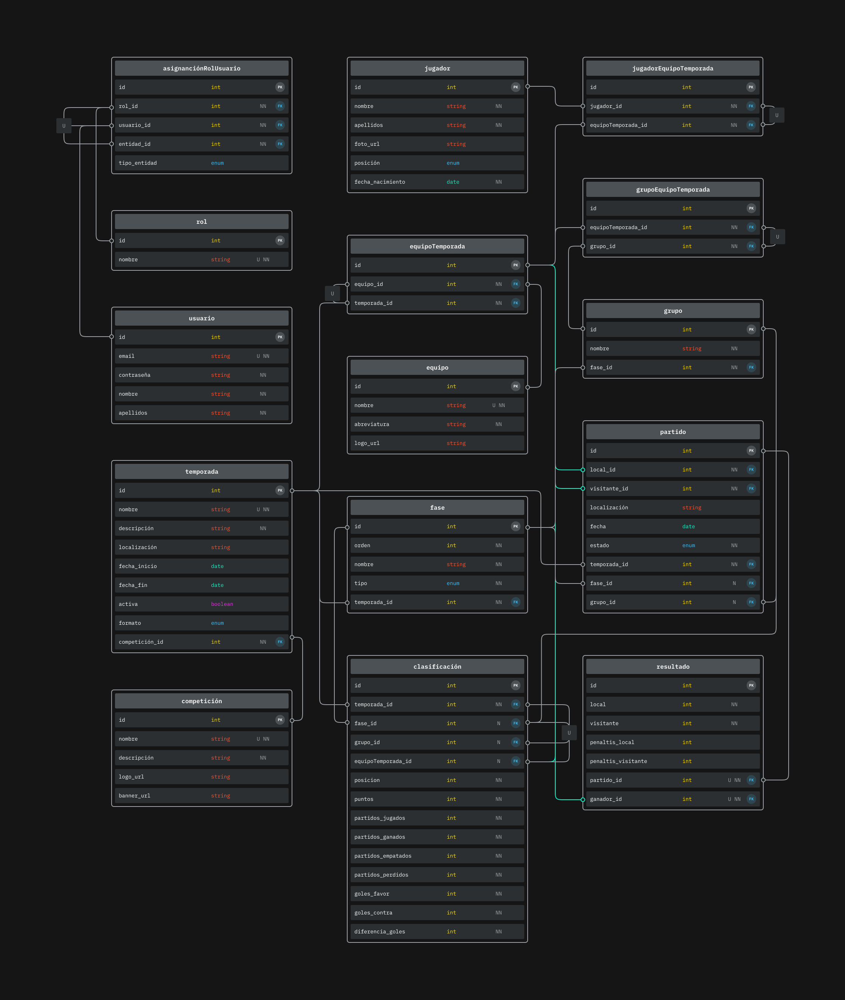

###### Nota: este diagrama está parcialmente desactualizado conforme a esta documentación. Faltando tablas para las fases eliminatorias y las reglas de desempate avanzadas.
### 9.3. Modelo de Clasificación Unificado

Para gestionar las tablas de clasificación de manera flexible tanto para ligas completas como para fases de grupos, optamos por una entidad única **standing**. Esta tabla representa **una fila individual** dentro de la clasificación, detallando la posición y estadísticas de un equipo específico en un contexto determinado.

Los atributos clave de **standing** incluyen campos como `season_id`, `phase_id`, `cgroup_id` (diferenciador clave), `team_season_id`, `position`, `score`, y diversos contadores de estadísticas de juego.

### 9.4. Funcionalidades Avanzadas

El diseño incluye soporte integral para:

- **Torneos Eliminatorios**: A través de la tabla `knockout_series` con formatos configurables
- **Gestión Flexible de Fases**: Soporte para múltiples formatos (league, cgroup, knockout)
- **Reglas de Desempate Avanzadas**: Tabla `phase_tiebreaker_rules` con configuración flexible
- **Sistema de Registro y Aprobación**: Flujo completo de inscripción de equipos
- **Gestión Contextual de Roles**: Sistema de permisos basado en contexto específico

### 9.5. Decisiones de Diseño y Optimizaciones

Tomamos varias decisiones importantes para optimizar el rendimiento:

- **Denormalización Controlada**: Almacenamiento del equipo ganador (`winner_id`) para optimizar consultas
- **Vínculos Directos**: Mantenimiento de `game.season_id` para evitar JOINs costosos
- **Indexación Estratégica**: Índices optimizados para patrones de consulta comunes
- **Integridad Automatizada**: Triggers para timestamps y Row Level Security habilitado

## 10. Conclusiones

### 10.1. Cumplimiento de Objetivos

El proyecto MatchStats19 no ha logrado cumplir satisfactoriamente con los objetivos planteados inicialmente. Aunque, desarrollamos exitosamente una aplicación multiplataforma funcional que demuestra la viabilidad técnica y comercial de una solución integral para la gestión de competiciones deportivas con un MVP (Producto Mínimo Viable).

**Objetivos Alcanzados:**

- **Aplicación Multiplataforma Funcional**: Implementamos una aplicación que funciona correctamente en iOS y Android utilizando React Native y Expo, demostrando la eficacia del stack tecnológico seleccionado.

- **Gestión Integral de Competiciones**: La aplicación permite visualizar pero nogestionar diferentes tipos de competiciones (ligas y copas), adaptándose dinámicamente al formato de cada una mediante el sistema de fases desarrollado.

- **Interfaz de Usuario Intuitiva**: Logramos crear una interfaz moderna, atractiva y fácil de usar, inspirada en aplicaciones profesionales del sector como LiveScore y SofaScore.

- **Arquitectura Escalable**: El diseño modular del código y la separación clara de responsabilidades facilitan el mantenimiento y futuras expansiones del proyecto.

### 10.2. Logros Técnicos Destacados

**Sistema de Fases Dinámico**: Una de las innovaciones más significativas del proyecto ha sido el desarrollo de un sistema que analiza automáticamente los datos de competiciones y los organiza en fases apropiadas. Esto permite que la aplicación se adapte automáticamente a diferentes formatos de competición sin intervención manual.

**Gestión Eficiente de APIs Externas**: La implementación de mappers de transformación de datos y el servicio centralizado de comunicación con APIs demuestra buenas prácticas de desarrollo, manteniendo la independencia entre formatos externos e internos.

**Interfaz Adaptativa**: El sistema de navegación por pestañas dinámico que se adapta según el tipo de competición disponible representa un logro significativo en términos de experiencia de usuario.

**Diseño de Base de Datos Robusto**: Aunque no implementado por limitaciones de tiempo, el diseño de base de datos propuesto demuestra un entendimiento profundo de los requisitos del dominio y proporciona una base sólida para implementaciones futuras.

### 10.3. Limitaciones y Decisiones Pragmáticas

**Uso de API Externa**: Debido a las limitaciones temporales del proyecto (2 semanas vs. las 24 semanas ideales), tomamos la decisión pragmática de utilizar API-Football como fuente de datos en lugar de implementar completamente el backend propio. Esta decisión permitió:

- Demostrar las funcionalidades de la aplicación con datos reales
- Concentrar esfuerzos en el desarrollo del frontend y la experiencia de usuario
- Validar el concepto con datos actualizados y variados

**Funcionalidades Aplazadas**: Aplazamos algunas funcionalidades planificadas para versiones futuras, como:

- Sistema completo de autenticación y gestión de usuarios
- Notificaciones push en tiempo real
- Funcionalidades de administración de competiciones

### 10.4. Validación del Concepto

El proyecto ha demostrado exitosamente la viabilidad de desarrollar una solución competitiva en el mercado de gestión de competiciones deportivas. La validación con usuarios reales durante el proceso de diseño UI/UX y la positiva retroalimentación recibida confirman que existe una necesidad real en el mercado.

**Ventajas Competitivas Identificadas:**

- Interfaz moderna y atractiva comparada con soluciones existentes
- Adaptabilidad y flexibilidad automática a diferentes formatos de competición
- Enfoque multiplataforma desde el diseño inicial
- Arquitectura técnica moderna y escalable

### 10.5. Aprendizajes y Crecimiento Profesional

Este proyecto meha proporcionado una experiencia valiosa en múltiples aspectos del desarrollo de software:

**Técnicos:**

- Dominio de React Native y el ecosistema de desarrollo móvil multilataforma
- Comprensión de arquitecturas de aplicaciones multiplataforma orientadas a componentes
- Experiencia práctica en integración de APIs y gestión de datos externos
- Ampliacion y aplicación de conocimientos en diseño de bases de datos relacionales

**Metodológicos:**

- Gestión de proyectos con limitaciones temporales estrictas
- Toma de decisiones técnicas balanceando idealismo y pragmatismo
- Validación de conceptos con usuarios reales

### 10.6. Impacto y Líneas de Futuro

El proyecto MatchStats19 sienta las bases para una solución que puede tener un impacto real en la organización de competiciones deportivas amateur. La colaboración establecida con @staff19torneos como early adopter proporciona una ruta clara hacia la implementación práctica y el crecimiento del proyecto.

**Próximos Pasos Identificados:**

1. Implementación completa del backend basado en el diseño de base de datos propuesto o similar
2. Desarrollo de funcionalidades de administración para organizadores
3. Sistema de notificaciones en tiempo real
4. Expansión a otros deportes y formatos de competición
5. Exploración de oportunidades de monetización y escalabilidad comercial

### 10.7. Conclusión Final

MatchStats19 representa un MVP exitoso que combina innovación técnica, diseño centrado en el usuario y comprensión profunda del dominio del problema. A pesar de las limitaciones temporales, logramos crear una base sólida que demuestra el potencial de impacto en el mercado de gestión deportiva amateur.

El proyecto no solo cumple con los objetivos académicos establecidos, sino que también proporcionará valor real a usuarios finales y establece fundamentos para un futuro crecimiento comercial. La experiencia adquirida y las lecciones aprendidas durante el desarrollo constituyen un valioso activo para futuros proyectos y crecimiento profesional.

## 11. Bibliografía

- [¿Qué es React Native?](https://openwebinars.net/blog/react-native-que-es-para-que-sirve/) - 28 de marzo de 2025
- [Reducir costes con React Native](https://richestsoft.com/es/blog/how-react-native-can-reduce-cost-of-mobile-app-development/) - 28 de marzo de 2025
- [¿Qué es Expo?](https://es.linkedin.com/pulse/qu%C3%A9-es-expo-10-caracter%C3%ADsticas-que-tenes-saber-2023-denis-borovskoy) - 28 de marzo de 2025
- [¿Qué es Supabase?](https://www.aplyca.com/blog/blog-supabase-una-alternativa-agil-de-codigo-abierto) - 28 de marzo de 2025
- [Supabase vs Firebase](https://openwebinars.net/blog/supabase-vs-firebase/) - 28 de marzo de 2025
- [API-Football Documentation](https://www.api-football.com/documentation-v3) - Consultado durante el desarrollo del proyecto
- React Native Documentation. Meta Platforms, Inc. https://reactnative.dev/ - Consultado durante el desarrollo
- Expo Documentation. Expo. https://docs.expo.dev/ - Consultado durante el desarrollo
- Supabase Documentation. Supabase. https://supabase.com/docs - Consultado durante el desarrollo
- [Xporty - Gestión de Torneos](https://www.xporty.com/) - Análisis de competencia
- [MyGol - Software Deportivo](https://mygol.es/) - Análisis de competencia
- [Winner - Organizador de Torneos](https://winner-9bee4.firebaseapp.com/es/) - Análisis de competencia
- [Toornament - Competiciones eSports](https://www.toornament.com/es/) - Análisis de competencia
